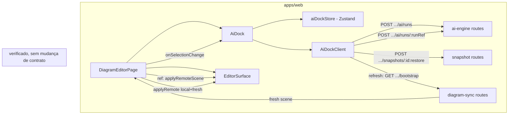
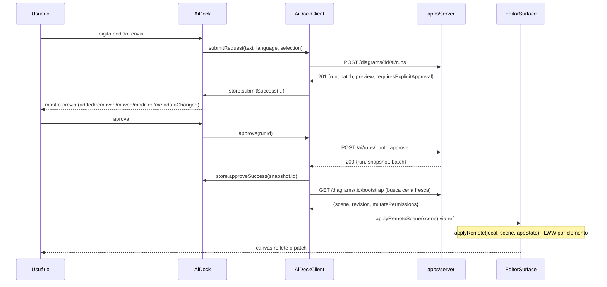

# Dock de IA — Design

**Spec**: `.specs/features/ai-dock/spec.md`
**Status**: Approved

---

## Approach exploration

Duas abordagens viáveis para o problema central — como o canvas reflete o patch aprovado e o
conteúdo restaurado pelo undo, já que nenhuma delas tem hoje um caminho pronto no frontend.

| | **A — Reconciliação via `applyRemote` (recomendada)** | **B — Remount por `key`** |
| --- | --- | --- |
| Mecanismo | `EditorSurface` ganha um handle imperativo (`excalidrawAPI` + `useImperativeHandle`) que recebe a cena fresca (via `GET /bootstrap` de novo) e a funde com a cena local usando `applyRemote` (LWW por elemento, já existe em `editor-adapter`, nunca chamado por ninguém hoje) antes de `updateScene`. | Troca o `key` de `<EditorSurface>` a cada aprovação/undo, forçando o React a desmontar e remontar com `initialElements` novo. |
| Edições locais pendentes durante o run | Preservadas — é exatamente o que `reconcileElements`/AD-001 resolve: por elemento, versão mais alta (ou `versionNonce` menor em empate) vence. | Descartadas silenciosamente — o remount ignora qualquer elemento desenhado localmente que ainda não foi confirmado pelo `operations:batch`. |
| Conflito com invariante existente | Nenhum. | Viola AD-001 ("sincronização por op-log LWW... elemento por elemento") na única superfície onde isso importaria de verdade: usuário editando enquanto o run está em voo (P1 AC4 exige exatamente isso — "sem impedir a edição manual do canvas"). |
| Reuso | Usa `applyRemote` pela primeira vez — a mesma função que R10 (colaboração em tempo real) vai precisar para aplicar deltas remotos ao vivo. Este é o primeiro caller real. | Não usa `applyRemote`; R10 teria que resolver o mesmo problema do zero. |
| Custo de implementação | Uma mudança pequena e contida em `editor-adapter` (expor uma API imperativa) — sem novo pacote, sem nova dependência. | Menor nesta onda isolada, mas empurra o débito para R10. |

**Escolhida: A.** A perda silenciosa de edição local descartada por B é exatamente o tipo de
regressão que AD-001 foi desenhada para prevenir, e a spec (P1 AC4) declara explicitamente que a
edição manual continua liberada enquanto o run está em andamento — então o cenário que B quebra
não é hipotético, é uma AC. O custo extra de A é pago uma vez e beneficia R10 diretamente.

---

## Architecture Overview

O dock é um componente novo, irmão do canvas dentro de `DiagramEditorPage`, com seu próprio
cliente HTTP e store — nenhuma rota, schema ou comportamento do `ai-engine` muda. A única mudança
de servidor é aditiva: o `bootstrap` passa a devolver também a decisão `diagram:mutate` (hoje só
devolve a decisão `diagram:read`, o que deixa o frontend sem sinal correto para decidir se
renderiza o dock — ver Risks & Concerns).



Fluxo de aprovação, ponta a ponta:



---

## Code Reuse Analysis

### Existing Components to Leverage

| Component | Location | How to Use |
| --- | --- | --- |
| `applyRemote` | `packages/editor-adapter/src/applyRemote.ts` | Primeiro caller real — funde a cena local com a cena fresca pós-approve/undo, elemento por elemento (AD-001). |
| `createSaveStatusStore` (padrão) | `apps/web/src/sync/saveStatus.ts:24-47` | Molde exato para `createAiDockStore` — factory Zustand, `useMemo` no componente, seletores de leitura. |
| `DiagramSyncClient` (padrão) | `apps/web/src/sync/syncClient.ts` | Molde para `AiDockClient`: `fetchImpl` injetável (`fetch.bind(globalThis)`), branch por `response.status`, interfaces de resposta declaradas à mão (sem cliente OpenAPI gerado). |
| `saveStatusTranslationKey` (padrão) | `apps/web/src/sync/saveStatus.ts:20-22` | Molde para `aiDockStatusTranslationKey(status) => \`aiDock.status.${status}\`` — nenhuma string literal em JSX. |
| i18n `translation.json` (`pt-BR`/`en`) | `apps/web/src/i18n/locales/*/translation.json` | Novo bloco `"aiDock": {...}` no mesmo nível de `"diagram"`/`"saveStatus"`. |
| `shell.a11y.spec.tsx` (padrão) | `apps/web/src/a11y/shell.a11y.spec.tsx` | Molde para `apps/web/src/ai-dock/AiDock.a11y.spec.tsx` — mesmo helper `seriousOrCriticalViolations`. O comentário deste arquivo (linhas 30-46) já anota que o dock de IA "ainda não tem componente React"; esta feature fecha essa nota. |
| `can()` (RBAC) | `@arch-canvas/auth`, já importado em `diagram-sync/routes.ts` e `ai-engine/routes.ts:133` | Reusado tal qual para computar a decisão `diagram:mutate` dentro do handler de bootstrap. |

### Integration Points

| System | Integration Method |
| --- | --- |
| `POST /diagrams/:id/ai/runs`, `POST /ai/runs/:runRef`, `POST /diagrams/:id/snapshots/:id:restore` | Consumidas tal como estão — nenhum schema, rota ou comportamento muda. |
| `GET /diagrams/:id/bootstrap` | Único endpoint com mudança de contrato (aditiva): novo campo `mutatePermissions`. Reusado uma segunda vez (além do mount inicial) para buscar a cena fresca pós-approve/undo. |
| `editor-adapter` (`EditorSurface`) | Ganha `onSelectionChange` e um handle imperativo `applyRemoteScene` — ambos aditivos, a assinatura existente (`initialElements`, `onDeltas`) não muda. |

---

## Components

### `mutatePermissions` no bootstrap (servidor)

- **Purpose**: dar ao frontend um sinal correto de `diagram:mutate`, que hoje não existe — o campo `permissions` existente reflete `diagram:read` (sempre `true` quando a resposta chega, porque a rota já faz `notFound()` acima se a leitura for negada; confirmado pelo teste de integração existente `bootstrap.int.spec.ts` com papel `viewer`).
- **Location**: `apps/server/src/modules/diagram-sync/routes.ts` (handler de `GET /diagrams/:id/bootstrap`, em torno da linha 70-81).
- **Interface**: adiciona `mutatePermissions: PermissionDecision` ao corpo de resposta, computado com `can({ role }, 'diagram:mutate', { workspaceId })` — a mesma chamada já usada em `ai-engine/routes.ts:133` e `snapshot/routes.ts`. `permissions` (a decisão de leitura) permanece inalterado, byte a byte, para não quebrar nenhum consumidor existente.
- **Dependencies**: `@arch-canvas/auth`'s `can()`, já uma dependência do módulo.
- **Reuses**: o mesmo padrão de decisão já usado em 3 outros lugares deste módulo/vizinhos.

### `AiDockClient`

- **Purpose**: cliente HTTP do dock — cria o run, aprova, cancela, restaura o undo, busca a cena fresca pós-aplicação. Nunca toca `mutationQueue`/`DiagramSyncClient` — é uma preocupação isolada, só lê o resultado de `bootstrap()` para o refresh de cena.
- **Location**: `apps/web/src/ai-dock/aiDockClient.ts`.
- **Interfaces**:
  - `constructor(options: { diagramId: string; store: UseBoundStore<StoreApi<AiDockState>>; fetchImpl?: typeof fetch })`
  - `submitRequest(userRequest: string, language: string, selection?: string[]): Promise<void>` — `POST /diagrams/:id/ai/runs`; trata `201` (com/sem `preview`), `403`, `424` (`NoProviderConfiguredError`), `429`.
  - `approve(runId: string): Promise<void>` — `POST /ai/runs/:runId:approve`; trata `200`, `409`.
  - `cancel(runId: string): Promise<void>` — `POST /ai/runs/:runId:cancel`.
  - `undo(snapshotId: string): Promise<void>` — `POST /diagrams/:id/snapshots/:snapshotId:restore`; trata `200`, qualquer outro status mantém a ação disponível.
  - `refreshScene(): Promise<{ scene: SceneElement[] }>` — chama `GET /diagrams/:id/bootstrap` de novo (reuso puro, nenhuma rota nova) e devolve a cena para `DiagramEditorPage` fundir via `applyRemote`.
- **Dependencies**: `fetch` (injetável), a store do dock.
- **Reuses**: molde estrutural de `DiagramSyncClient` (branch por status, `fetchImpl` injetável).

### `aiDockStore` (`createAiDockStore`)

- **Purpose**: estado efêmero do dock — molde de `createSaveStatusStore`.
- **Location**: `apps/web/src/ai-dock/aiDockStore.ts`.
- **Interfaces**:
  ```ts
  export type AiDockPhase =
    | 'idle' | 'submitting' | 'awaiting_approval' | 'approving'
    | 'applied' | 'restoring' | 'error' | 'rate_limited' | 'expired';

  export interface AiDockState {
    phase: AiDockPhase;
    requestText: string;
    run: { id: string; status: string } | null;
    preview: PreviewSummary | null;
    requiresExplicitApproval: boolean;
    errorCode: string | null;
    lastSnapshotId: string | null;   // undo só do run aplicado mais recente na sessão
    rateLimitedUntil: number | null; // epoch ms; dock reabilita envio quando passar
    // ações: setRequestText, submitStart, submitSuccess, submitFailed,
    // rateLimited, approveStart, approveSuccess, approveConflict,
    // cancelled, undoStart, undoSuccess, undoFailed, reset
  }
  ```
- **Dependencies**: `zustand`.
- **Reuses**: `createSaveStatusStore`'s factory shape.

### `AiDock` (componente)

- **Purpose**: painel lateral recolhível — campo de pedido, prévia, ações aprovar/descartar/desfazer, região `aria-live`.
- **Location**: `apps/web/src/ai-dock/AiDock.tsx`.
- **Interfaces**:
  - Props: `{ diagramId: string; canMutate: boolean; selection: readonly string[]; onApproved: () => Promise<void> }` — `onApproved` é o callback que `DiagramEditorPage` passa para acionar `refreshScene` + `applyRemoteScene` (o dock não conhece `EditorSurface`, só dispara o pedido de refresh).
  - Não renderiza nada (`return null`) quando `!canMutate` — DOCK-02.
- **Dependencies**: `AiDockClient`, `createAiDockStore`, `useTranslation`.
- **Reuses**: só elementos HTML nativos (`<textarea>`, `<button>`) — convenção já estabelecida em `LanguageSwitcher.tsx` de preferir controles nativos a widgets ARIA customizados, o que dá foco/tab-order de graça.

### `EditorSurface` (extensão)

- **Purpose**: expor seleção e um caminho imperativo de aplicar cena remota, sem quebrar a API existente.
- **Location**: `packages/editor-adapter/src/EditorSurface.tsx`.
- **Interfaces novas**:
  - `onSelectionChange?: (ids: string[]) => void` — lido do segundo argumento de `onChange` do Excalidraw (`appState.selectedElementIds`, um mapa `{[id]: true}`; convertido para array de chaves com valor truthy).
  - `forwardRef` com `useImperativeHandle` expondo `{ applyRemoteScene(remote: readonly SceneElement[]): void }` — internamente chama `excalidrawAPI.updateScene({ elements: applyRemote(currentLocal, remote, appState) })`. `excalidrawAPI` é capturado via a prop `excalidrawAPI={(api) => { apiRef.current = api }}` do próprio `<Excalidraw/>` (não usada até agora).
- **Dependencies**: `applyRemote` (já no mesmo pacote).
- **Reuses**: `applyRemote`, a mesma técnica de cast estrutural (`as any` documentado) já usada na prop `initialData`.

### `DiagramEditorPage` (extensão)

- **Purpose**: orquestra o layout novo (linha, não coluna), passa `canMutate`/`selection` para o dock, e liga `onApproved`/`onUndo` do dock ao `applyRemoteScene` do `EditorSurface`.
- **Location**: `apps/web/src/diagram/DiagramEditorPage.tsx`.
- **Mudança de layout**: container externo passa de `flexDirection: 'column'` para `'row'`; a coluna atual (status + canvas) vira um filho `flex: 1, minHeight: 0` dentro da linha; o `<AiDock>` é o segundo filho, largura fixa, só renderizado quando `canMutate` é `true`.
- **Reuses**: o próprio padrão já usado para o `ref`/`useMemo` de `DiagramSyncClient`.

---

## Data Models

### Resposta de `GET /diagrams/:id/bootstrap` (servidor, aditivo)

```typescript
interface BootstrapResponse {
  scene: SceneElement[];
  revision: number;
  assets: unknown[];
  permissions: { allowed: boolean; reason: string };       // inalterado (diagram:read)
  mutatePermissions: { allowed: boolean; reason: string };  // NOVO (diagram:mutate)
}
```

### `AiDockState` — ver Components acima.

### `PreviewSummary` (já existe no servidor, espelhado no cliente)

```typescript
interface PreviewSummary {
  added: string[];
  removed: string[];
  moved: string[];
  modified: string[];
  metadataChanged: string[];
}
```

**Relationships**: `AiDockState.preview` é um `PreviewSummary | null`; `AiDockState.run.id` referencia o `runId` usado em `:approve`/`:cancel`; `AiDockState.lastSnapshotId` referencia o `snapshot.id` devolvido por `:approve`, usado no `:restore`.

---

## Error Handling Strategy

| Error Scenario | Handling | User Impact |
| --- | --- | --- |
| `POST .../ai/runs` → 429 | `AiDockClient` lê o corpo, marca `rateLimitedUntil = Date.now() + 60_000`, preserva `requestText`. Um `setInterval`/checagem no componente reabilita o envio quando `Date.now() >= rateLimitedUntil`. | Mensagem de limite atingido; texto preservado; reabilita em 60s (DOCK-05). |
| `POST .../ai/runs` → 424 (`NoProviderConfiguredError`) | Fase vai para `error` com `errorCode: 'no_provider_configured'`. | Mensagem específica (chave i18n dedicada) — "configuração ausente, feita fora do produto hoje" — sem oferecer caminho que não existe. |
| `POST .../ai/runs` → 403 | Não deveria acontecer na prática (dock não renderiza sem `canMutate`), mas tratado defensivamente como `error` genérico — não é um caminho que a spec pede UX dedicada, só não pode quebrar. | Mensagem de erro genérica. |
| Resposta 201 sem `preview` | `withPreview` ausente no corpo (run falhou antes de `previewing`) — fase `error`, exibe `run.errorCode`. | Sem oferecer aprovar (DOCK-09). |
| `run.status === 'failed'` | Fase `error`, texto = chave i18n `aiDock.error.<errorCode>` com *fallback* que ainda interpola o código bruto (`aiDock.error.unknown` = "Erro: {{code}}") — nunca perde o código mesmo quando não há tradução dedicada (DOCK-10). | Código sempre visível, mensagem amigável quando existir uma. |
| `POST .../ai/runs/:runId:approve` → 409 | Fase volta a `idle` com o texto preservado, preview descartado, mensagem "o diagrama mudou desde o pedido". | Nenhuma operação do patch é aplicada (DOCK-15). |
| `POST .../snapshots/:id:restore` → não-200 | Fase permanece com Desfazer disponível; nunca reporta sucesso. | Usuário pode tentar de novo; nenhuma falsa confirmação (DOCK-19). |
| Falha de rede durante qualquer chamada (`fetch` rejeita) | Fase `error` com mensagem de falha de rede; texto do pedido preservado; envio reabilitado. | Nunca trava o botão de envio permanentemente. |
| Run com `awaiting_approval` cujo patch não existe mais (reinício de processo, `RunStore` em memória perdeu o run) | `:approve` devolve um erro tratado (provavelmente 404/409 do servidor); dock trata como expirado, pede novo pedido. | Nunca oferece aprovar um run fantasma. |

---

## Risks & Concerns

| Concern | Location (file:line) | Impact | Mitigation |
| --- | --- | --- | --- |
| `bootstrap`'s `permissions` reflete `diagram:read`, não `diagram:mutate` — sem esta mudança o dock não tem como decidir renderizar (DOCK-02) sem uma chamada extra ou um flash-then-hide. | `apps/server/src/modules/diagram-sync/routes.ts:70-81` | Sem o campo novo, DOCK-02 (nunca renderizar para quem não pode mutar) não é implementável corretamente no primeiro paint. | Campo aditivo `mutatePermissions` no bootstrap (ver Components). Não quebra consumidores existentes — só soma um campo. |
| `EditorSurface` não expõe nenhuma API imperativa hoje — Excalidraw é montado com `initialData` (aplicado uma vez só) e sem `excalidrawAPI` capturado. | `packages/editor-adapter/src/EditorSurface.tsx:32-49` | Sem essa extensão, não existe caminho para refletir o patch aprovado ou o undo no canvas sem descartar edição local concorrente (ver Approach exploration). | `forwardRef` + `useImperativeHandle` novos, aditivos — assinatura de props existente inalterada. Coberto por teste próprio em `editor-adapter` (task dedicada). |
| `applyRemote` nunca foi chamado por nenhum código real até agora — só testado isoladamente em `applyRemote.spec.ts`. | `packages/editor-adapter/src/applyRemote.ts` | Primeiro uso em produção pode expor uma lacuna de integração que o teste unitário isolado não cobre (ex. shape exato de `appState` esperado por `excalidrawAPI.updateScene`). | Task de Execute inclui um teste de integração do fluxo completo (aprovar → cena reflete no `EditorSurface`) montando o componente real, não só mockando `applyRemote`. |
| `RunStore` é em memória (AD já registrada em F2) — um run em `awaiting_approval` não sobrevive a um restart do processo nem a reload da página. | `apps/server/src/modules/ai-engine/runStore.ts` (pré-existente, fora do escopo desta feature) | Já é um Edge Case coberto pela spec (run expirado) — não é uma regressão desta feature, só um limite herdado. | Nenhuma — já mitigado pela spec (dock trata como expirado, sem novo comportamento a inventar). |
| O texto do pedido do usuário nunca é limitado por caractere — a spec só bloqueia campo vazio/só espaço. | `apps/server/src/modules/ai-engine/routes.ts:57-62` (`z.string().min(1)`, sem `.max()`) | Fora do escopo — o backend já aceita qualquer tamanho e está verificado; nenhuma mudança de contrato é permitida por esta spec. | Nenhuma — documentado, não é uma regressão introduzida aqui. |

> Nenhum outro risco de segurança, performance ou dívida técnica identificado nas áreas tocadas por esta feature.

---

## Tech Decisions

| Decision | Choice | Rationale |
| --- | --- | --- |
| Como o canvas reflete o patch aprovado / o undo | `applyRemote` (LWW) sobre uma cena fresca buscada via `GET .../bootstrap`, aplicada via handle imperativo novo em `EditorSurface` | Ver "Approach exploration" — a alternativa (remount por `key`) descarta edição local concorrente, o que viola AD-001 e contradiz P1 AC4 da própria spec. |
| Onde mora o estado efêmero do dock | Zustand, `createAiDockStore` — mesmo padrão de `createSaveStatusStore`/`createMutationQueue` | Já é a convenção documentada em `mutationQueue.ts:41-46` ("Zustand é para estado de cliente efêmero como esta fila") — TanStack Query segue não instalado no projeto; introduzi-lo só para esta fatia seria uma mudança de infraestrutura maior do que a spec pede. |
| Como o frontend sabe se o papel do usuário concede `diagram:mutate` | Novo campo `mutatePermissions` no bootstrap (servidor) | Único jeito correto e proativo — hoje isso só é descoberto reativamente por um 403 num `POST` de mutação, o que a spec (DOCK-02, edge case do assumptions table) explicitamente rejeita como pior que não oferecer o campo. |
| Onde o componente do dock mora no código | `apps/web/src/ai-dock/` (pasta nova, mesmo nível de `app-shell/`, `diagram/`, `sync/`) | Segue a convenção já estabelecida de pasta por feature, sem introduzir um `components/` genérico que não existe hoje. |

> **Decisão de nível de projeto.** A extensão de `EditorSurface` com um handle imperativo
> (`applyRemoteScene` via `forwardRef`/`useImperativeHandle`) e o primeiro uso real de
> `applyRemote` estabelecem o padrão que R10 (colaboração em tempo real) vai reusar diretamente
> para aplicar deltas de presença/edição remota ao vivo — não é uma decisão local só desta
> feature. Registrada como `AD-010` em `.specs/STATE.md`.

---

## Tasks preview (não vinculante — a rodada de Tasks decide o breakdown final)

Ordem de dependência: extensão de `bootstrap` (servidor) e extensão de `EditorSurface`
(editor-adapter) não dependem uma da outra e podem ser tasks paralelas; `AiDockClient`/`aiDockStore`
dependem de nenhuma das duas; `AiDock` (componente) depende de `aiDockStore`+`AiDockClient`;
`DiagramEditorPage` (integração final) depende de tudo acima.
