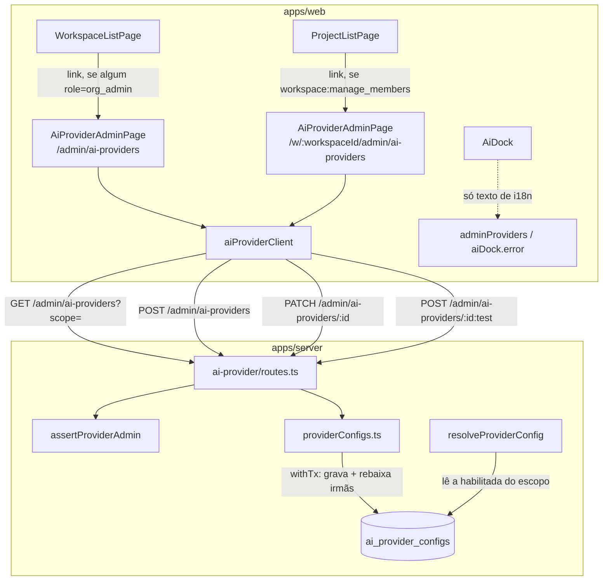

# Administração do provider de IA — Design

**Spec**: `.specs/features/ai-provider-admin/spec.md`
**Status**: Approved

---

## Approach exploration

Duas decisões de arquitetura reais nesta onda. Nenhuma tem caminho pronto no código: esta é a
primeira tela autenticada do app fora da hierarquia `/w/:workspaceId/...`, e é a primeira vez que
uma escrita deste projeto precisa manter um invariante entre linhas irmãs.

### 1. Forma de rota: escopo na URL vs. escopo em estado de componente

O escopo administrado é ou a string literal `"global"` (instância inteira) ou um `workspaceId`. A
metade global não tem workspace nenhum na URL, e o app hoje só conhece `/` e `/w/:workspaceId/...`.

| | **A — Duas rotas, um componente (recomendada)** | **B — Uma rota com seletor de escopo** |
| --- | --- | --- |
| Forma | `/admin/ai-providers` (escopo `global`) e `/w/:workspaceId/admin/ai-providers` (escopo do workspace), ambas renderizando o mesmo `AiProviderAdminPage`, que lê o escopo de `useParams()` | Só `/admin/ai-providers`, com um `<select>` de escopo dentro da página (global + os workspaces onde o usuário é admin) |
| Relação com a autorização do servidor | Direta: `assertProviderAdmin` decide por escopo, e o escopo é a rota. Um `403`/`404` do servidor casa exatamente com a URL que o usuário abriu | Indireta: uma única URL pode devolver 200 num escopo e 403 no seguinte, sem que a URL mude — o usuário não tem como linkar, favoritar ou reportar o estado que viu |
| Ponto de entrada | Dois links diretos, cada um gated pelo mesmo papel que o servidor exige naquele escopo (`ProjectListPage` para o workspace, `WorkspaceListPage` para o global) | Um link só, mas a página precisa montar a lista de escopos elegíveis antes de qualquer coisa — trabalho extra e um segundo gate de papel dentro da página |
| Convenção existente | A metade de workspace fica irmã de `/w/:workspaceId/members`, exatamente onde `workspace-members` (R4) ensinou o usuário a procurar administração de workspace | Rompe com a convenção: administração de um workspace deixaria de morar sob a URL daquele workspace |
| Custo | Duas entradas em `App.tsx`, um componente parametrizado. A metade global é a primeira rota autenticada fora de `/w/...`, mas encaixa sem mudança nenhuma no `AppShell` (é só mais um filho do `<Outlet/>`) | Um componente e uma rota, mas com estado de escopo, lista de escopos e um segundo caminho de gate — mais código, não menos |

**Escolhida: A.** O escopo é a fronteira de autorização do servidor; escondê-lo em estado de
componente separa a URL da permissão exatamente na tela onde permissão é o assunto. O custo real de
A é uma linha a mais em `App.tsx`; o custo de B é uma máquina de estado de escopo que não existe em
lugar nenhum do app hoje.

### 2. Exclusividade de "ativo" por escopo: onde e como garantir

Hoje nada impede duas linhas com `enabled = true` no mesmo `scope`, e `resolveProviderConfig`
(`apps/server/src/modules/ai-engine/resolveProvider.ts:28-38`) lê a primeira sem `ORDER BY` nem
`LIMIT`. Qual provider atende um run é, nesse estado, indefinido.

| | **A — Rebaixar irmãs na mesma transação (recomendada)** | **B — Índice único parcial no banco** | **C — Duas chamadas no handler da rota** |
| --- | --- | --- | --- |
| Mecanismo | `createProviderConfig`/`updateProviderConfig` passam a rodar dentro de `withTx`: grava a linha, e se o estado resultante for `enabled = true`, faz `UPDATE ... SET enabled = false WHERE scope = <scope da linha> AND id <> <id>` | `CREATE UNIQUE INDEX ... ON ai_provider_configs (scope) WHERE enabled` mais uma migração | `routes.ts` chama `updateProviderConfig` e depois um `disableOthers` separado, sem transação |
| Semântica de "alternar" | Ativar a segunda **troca**: a primeira é rebaixada, exatamente o que a tela promete | Ativar a segunda **falha** com violação de constraint enquanto a primeira estiver ativa; a UI teria que desativar antes de ativar, em dois passos, com uma janela sem nenhum provider ativo | Igual a A no caminho feliz |
| Atomicidade | Sim: uma falha em qualquer metade desfaz a outra | Sim, mas só se recusando a escrever | Não: um erro entre as duas chamadas deixa duas linhas ativas — o estado exato que a mudança existe para impedir |
| Dado pré-existente | Converge na primeira escrita de cada escopo, com intenção explícita do administrador | Impede a criação do índice enquanto houver escopo com duas ativas: exigiria migração de dados escolhendo arbitrariamente qual sobrevive | Igual a A |
| Blast radius | `apps/server/src/modules/ai-provider/providerConfigs.ts`, duas funções; nenhuma mudança de contrato de rota, nenhuma migração | Migração nova, `packages/database`, e todo caminho de escrita existente passa a poder falhar por constraint | Menor em linhas, maior em risco |

**Escolhida: A.** É a única que entrega "alternar" como troca atômica sem migração e sem transformar
a operação central da tela em erro de constraint. A garantia fica no repositório
(`providerConfigs.ts`), não no handler, então vale para qualquer chamador das duas rotas — esta
tela, `curl` ou um script de operação.

Rejeitar B tem um custo consciente: sem índice, uma escrita que **não** passe por estas funções
(SQL direto no banco) ainda pode criar duas linhas ativas. Registrado em Risks & Concerns; a
convergência na primeira escrita seguinte é a mitigação aceita nesta onda.

---

## Architecture Overview

Uma superfície nova (`AiProviderAdminPage`), montada em duas rotas, com cliente HTTP dedicado. No
servidor, nenhuma rota nova e nenhum contrato alterado: só as duas funções de escrita de
`providerConfigs.ts` passam a rodar dentro de uma transação que mantém o invariante de escopo.



O caminho que consome o resultado (`resolveProviderConfig` → pipeline de IA) não muda em nenhuma
linha: ele passa a ler de uma tabela onde no máximo uma linha por escopo está habilitada.

---

## Code Reuse Analysis

### Existing Components to Leverage

| Component | Location | How to Use |
| --------- | -------- | ---------- |
| `withTx` | `packages/database/src/tx.ts` | Envolve as duas escritas de `providerConfigs.ts`; é o mesmo helper que `appendOperation` (`diagram-sync/operations.ts:135`) já usa para escrita multi-passo |
| `memberClient.ts` (padrão) | `apps/web/src/nav/memberClient.ts` | Molde do cliente dedicado: `createXClient(fetchImpl?)`, uma união de status por rota, chamadas `fetchImpl(...)` literais para o extrator do `repo-tools audit` reconhecer |
| `WorkspaceMembersPage.tsx` (padrão) | `apps/web/src/nav/WorkspaceMembersPage.tsx` | Molde da página administrativa: `useParams`, link de voltar, região `aria-live="polite"`, estado `notFound` para 403/404, formulário com submit único |
| `resourceListStore` | `apps/web/src/nav/resourceListStore.ts` | Store de lista (`setItems`/`addItem`/`replaceItem`/`status`) — as configs têm `id: string`, então serve direto, sem shim (diferente de `WorkspaceMembersPage`, que precisou mapear `userId` → `id`) |
| `can()` / `Role` | `packages/auth` | Gate do link de workspace (`workspace:manage_members` concede exatamente `org_admin`/`workspace_admin`, os mesmos papéis que `assertProviderAdmin` exige num escopo de workspace) |
| `WorkspaceItem.role` | `apps/web/src/nav/WorkspaceListPage.tsx:12-16` | Deriva "é `org_admin` em algum lugar" sem nenhuma rota nova |
| Campo de senha do `LoginPage` | `apps/web/src/auth/LoginPage.tsx:126-131` | Forma do campo de chave (`type="password"` + `<label htmlFor>`), com `autoComplete="off"` em vez de `current-password`: não é credencial de login |
| `WorkspaceMembersPage.a11y.spec.tsx` | `apps/web/src/nav/` | Molde exato do teste de a11y: `jest-axe`, `seriousOrCriticalViolations`, foco por controle, `aria-live`, render em `en` |
| `ai-provider.int.spec.ts` | `apps/server/src/modules/ai-provider/` | Molde do teste de integração: PGlite + migrations, `seedWorkspaceWithRole`, leitura direta da tabela para provar estado persistido |

### Integration Points

| System | Integration Method |
| ------ | ------------------ |
| `ai-provider/routes.ts` | Consumido como está. Nenhum schema Zod, status ou corpo muda; `routeSchemas` (OpenAPI) fica intocado |
| `ai-engine/resolveProvider.ts` | Não é editado. Passa a operar sobre um estado onde o escopo tem no máximo uma linha habilitada |
| `App.tsx` | Duas rotas novas, ambas filhas do `<Route path="/">` que renderiza `AppShell` — a primeira delas (`admin/ai-providers`) é a primeira rota autenticada do app sem workspace na URL |
| i18n | Namespace novo de primeiro nível `adminProviders` nos dois locales; uma string existente (`aiDock.error.no_provider_configured`) reescrita |

---

## Components

### `providerConfigs.ts` — exclusividade de `enabled` por escopo (servidor)

- **Purpose**: garantir que, depois de qualquer escrita, o escopo tenha no máximo uma linha habilitada.
- **Location**: `apps/server/src/modules/ai-provider/providerConfigs.ts` (modificação)
- **Interfaces** (assinaturas públicas inalteradas — só o comportamento interno muda):
  - `createProviderConfig(db, input): Promise<ProviderConfigPublic>` — insere e, se a linha resultante ficar `enabled`, rebaixa as irmãs do mesmo `scope`, tudo dentro de `withTx`.
  - `updateProviderConfig(db, id, input): Promise<ProviderConfigPublic | null>` — atualiza e, se a linha resultante ficar `enabled`, rebaixa as irmãs do mesmo `scope`, tudo dentro de `withTx`.
- **Dependencies**: `withTx` (`@arch-canvas/database`), `aiProviderConfigs`, `drizzle-orm`'s `and`/`eq`/`ne`.
- **Reuses**: `withTx`, `PUBLIC_COLUMNS` (já existe neste arquivo).

O gatilho é o **estado resultante da linha**, não o corpo da requisição: um `PATCH` que só troca o
modelo de uma configuração já ativa também converge o escopo. É essa escolha que faz o caso de
borda "duas ativas de antes desta onda" se resolver sozinho na primeira escrita, sem migração.

### `aiProviderClient.ts`

- **Purpose**: cliente HTTP dedicado das 4 rotas de `/admin/ai-providers`.
- **Location**: `apps/web/src/nav/aiProviderClient.ts` (novo)
- **Interfaces**:
  - `createAiProviderClient(fetchImpl?: typeof fetch): AiProviderClient`
  - `list(scope: string): Promise<ProviderConfig[]>` — lança em resposta não-2xx (a página traduz para `notFound`, convenção IDOR).
  - `create(input: CreateProviderInput): Promise<CreateResult>` — `{status:'created', config} | {status:'rejected'} (400) | {status:'error'}`.
  - `update(id: string, patch: UpdateProviderInput): Promise<UpdateResult>` — `{status:'ok', config} | {status:'error'}`. `patch.token` ausente = a chave atual permanece (comportamento já implementado no servidor).
  - `testConnection(id: string): Promise<TestOutcome>` — `{status:'done', result} | {status:'rate_limited'} (429) | {status:'error'}`.
- **Dependencies**: nenhuma além de `fetch`.
- **Reuses**: forma e convenções de `memberClient.ts`.

`testConnection` devolve `{status:'done'}` para qualquer `200`, inclusive quando
`result.success === false` — a distinção sucesso/falha vive no corpo, não no status HTTP, e essa
separação é deliberada para que a página não possa confundir as duas coisas (PROV-19).

### `AiProviderAdminPage`

- **Purpose**: a superfície única desta onda — listar, cadastrar, editar, testar e alternar.
- **Location**: `apps/web/src/nav/AiProviderAdminPage.tsx` (novo)
- **Interfaces**: `AiProviderAdminPage({ fetchImpl? }): JSX.Element | null`
  - Escopo derivado da rota: `useParams<{workspaceId?: string}>()` → `workspaceId ?? 'global'`.
  - Link de voltar: `/w/:workspaceId` quando há workspace, `/` no escopo global.
- **Dependencies**: `aiProviderClient`, `resourceListStore`, `react-i18next`, `react-router-dom`.
- **Reuses**: estrutura de `WorkspaceMembersPage` (região `aria-live`, estado `notFound`, formulário com submit único, edição inline por linha).

Um componente serve as duas rotas: o escopo é o único parâmetro que muda, e ele já está na URL.

### `WorkspaceListPage` (extensão)

- **Purpose**: ponto de entrada da metade global.
- **Location**: `apps/web/src/nav/WorkspaceListPage.tsx` (modificação)
- **Interfaces**: sem mudança de props. Renderiza `<Link to="/admin/ai-providers">` quando `items.some(i => i.role === 'org_admin')`.
- **Reuses**: `WorkspaceItem.role`, já carregado pela própria página.

### `ProjectListPage` (extensão)

- **Purpose**: ponto de entrada da metade de workspace.
- **Location**: `apps/web/src/nav/ProjectListPage.tsx` (modificação)
- **Interfaces**: sem mudança de props. Renderiza `<Link to={`/w/${workspaceId}/admin/ai-providers`}>` sob o mesmo gate `workspace:manage_members`, ao lado do link "Membros" que já existe ali (`ProjectListPage.tsx:253`).

### `App.tsx` (extensão)

- **Purpose**: registrar as duas rotas.
- **Location**: `apps/web/src/App.tsx` (modificação)
- **Interfaces**: duas `<Route>` filhas de `/`: `admin/ai-providers` e `w/:workspaceId/admin/ai-providers`, ambas com `element={<AiProviderAdminPage />}`.

### i18n (`adminProviders`) e a mensagem do dock

- **Purpose**: todo texto visível fora do componente; e a frase do dock deixa de afirmar algo que esta onda torna falso.
- **Location**: `apps/web/src/i18n/locales/{pt-BR,en}/translation.json` (modificação)
- **Interfaces**: namespace novo `adminProviders.*`; `aiDock.error.no_provider_configured` reescrita nos dois locales, sem link (ver Assumptions da spec).

---

## Data Models

### `ProviderConfig` (cliente — espelha `ProviderConfigPublic` do servidor)

```typescript
export interface ProviderConfig {
  id: string
  scope: string
  baseUrl: string
  model: string
  capabilitiesJson: unknown
  enabled: boolean
  createdAt: string
  updatedAt: string
}
```

**Relationships**: espelha `ProviderConfigPublic`
(`apps/server/src/modules/ai-provider/providerConfigs.ts:10-19`), campo a campo, com `createdAt`/
`updatedAt` como `string` porque a serialização JSON converte `Date` em ISO. **Nenhum campo de
token existe nesta interface** — a ausência dele é o contrato, e o tipo é o lugar onde essa ausência
é aplicada no cliente, do mesmo jeito que `ProviderConfigPublic` a aplica no servidor.

### `CreateProviderInput` / `UpdateProviderInput` (cliente)

```typescript
export interface CreateProviderInput {
  scope: string
  baseUrl: string
  model: string
  token: string
}

export interface UpdateProviderInput {
  baseUrl?: string
  model?: string
  /** Ausente = a chave cifrada atual permanece intocada no servidor. */
  token?: string
  enabled?: boolean
}
```

### `TestConnectionResult` (cliente — espelha o corpo do `:test`)

```typescript
export interface TestConnectionResult {
  success: boolean
  modelAvailable: boolean
  toolCallingSupported: boolean
  error?: string
}
```

### Banco

Nenhuma mudança de schema, nenhuma migração. `ai_provider_configs` continua como está
(`packages/database/src/schema.ts:401-411`); o que muda é o invariante mantido pelas escritas.

---

## Error Handling Strategy

| Error Scenario | Handling | User Impact |
| -------------- | -------- | ----------- |
| `GET /admin/ai-providers` responde `403` (papel insuficiente) ou `404` (não é membro) | Página entra em estado `notFound` (mesma convenção IDOR de `workspace-navigation`) | Mensagem "não existe ou sem acesso" + link de voltar; nenhuma lista, nenhum formulário |
| `POST` responde `400` (baseUrl rejeitada por SSRF) | Cliente devolve `{status:'rejected'}`; formulário mantém os valores | Mensagem específica de URL rejeitada, campos preservados para correção |
| `POST`/`PATCH` respondem `403`/`500`/erro de rede | Cliente devolve `{status:'error'}`; lista não muda | Mensagem genérica na região `aria-live`, estado anterior preservado |
| `:test` responde `200` com `success: false` | Cliente devolve `{status:'done', result}`; página lê `result.success` | Resultado exibido como falha, com o texto de `error` do provider |
| `:test` responde `429` (limite 10/60s) | Cliente devolve `{status:'rate_limited'}` | Mensagem citando o limite; o botão volta a ficar disponível |
| `:test` falha por rede (sem resposta) | `try/catch` no cliente devolve `{status:'error'}`; a página limpa o estado "testando" no `finally` | Falha genérica; o botão nunca fica preso em carregamento |
| Segundo clique em "Testar conexão" com um teste em voo | Guarda por `id` em estado local; nenhuma segunda requisição | Botão desabilitado enquanto o teste corre |
| Transação de escrita falha no meio (rebaixamento das irmãs) | `withTx` desfaz tudo; a rota propaga o erro | Nenhuma escrita parcial: nem a linha alvo muda, nem as irmãs |

---

## Risks & Concerns

| Concern | Location (file:line) | Impact | Mitigation |
| ------- | -------------------- | ------ | ---------- |
| `resolveProviderConfig` lê a linha habilitada sem `ORDER BY` nem `LIMIT` | `apps/server/src/modules/ai-engine/resolveProvider.ts:28-38` | Com duas linhas habilitadas no mesmo escopo, qual provider atende um run é indefinido | Exclusividade garantida na escrita (PROV-23/24). A query não é editada de propósito: mexer nela sem o invariante só trocaria uma indefinição por uma ordem arbitrária. Com o invariante, a ausência de `ORDER BY` deixa de importar |
| Sem índice único parcial, uma escrita fora de `providerConfigs.ts` (SQL direto) ainda cria duas ativas | `packages/database/src/schema.ts:401-411` | O invariante é de aplicação, não do banco | Aceito conscientemente (ver Approach exploration 2): índice exigiria migração de dados e transformaria "alternar" em erro de constraint. Qualquer escrita seguinte pelas rotas converge o escopo |
| Linhas já habilitadas antes desta onda | dado, não código | Um escopo pode chegar nesta onda com duas ativas | Nenhuma migração de dados. A primeira escrita naquele escopo converge, com intenção explícita do administrador; coberto como caso de borda testado |
| `scope` é texto livre, sem FK para `workspaces` | `packages/database/src/schema.ts:403` | Arquivar um workspace deixa configurações órfãs, invisíveis em qualquer tela | Fora do escopo desta onda (mesmo padrão polimórfico de `share_links.resourceId`). Documentado aqui para não ser redescoberto como novidade |
| `assertProviderAdmin` trata `scope === 'global'` como "é `org_admin` em qualquer workspace" | `apps/server/src/modules/ai-provider/routes.ts:63-71` | Gate grosso: quem administra um único workspace com papel `org_admin` administra o provider da instância inteira | Não é alterado nesta onda (mudar autorização é decisão maior). O frontend espelha exatamente essa regra, sem inventar uma mais estrita nem mais frouxa, para que o link nunca leve a um 403 nem esconda algo permitido |
| `listProviderConfigs(db)` sem `scope` devolve todas as linhas de todos os escopos | `apps/server/src/modules/ai-provider/providerConfigs.ts:47-50` | Uma chamada sem `scope` vazaria configurações de outros workspaces para um `org_admin` | A rota já força `scope ?? 'global'` no gate antes de listar, e a página sempre passa um escopo explícito. Nenhuma chamada nova sem escopo é introduzida |
| Extrator de rotas do `repo-tools audit` só reconhece `fetch(`/`fetchImpl(` literais | lição registrada em `.specs/STATE.md` (residuais de `sso-sign-in` e `workspace-navigation`) | As 4 rotas continuariam como `pending-product` mesmo consumidas | `aiProviderClient.ts` usa `fetchImpl(...)` literal em todas as chamadas, sem wrapper local com alias |
| Limite de taxa do `:test` é 10/60s por usuário | `apps/server/src/modules/ai-provider/routes.ts:113-118` | Um teste automático no carregamento da tela consumiria a cota do administrador | A tela nunca testa sozinha: o teste só sai de um clique explícito |

---

## Tech Decisions

| Decision | Choice | Rationale |
| -------- | ------ | --------- |
| Forma de rota da tela | Duas rotas (`/admin/ai-providers`, `/w/:workspaceId/admin/ai-providers`), um componente parametrizado pelo escopo lido de `useParams()` | O escopo é a fronteira de autorização do servidor; ele pertence à URL. Mantém a administração de workspace irmã de `/w/:workspaceId/members`, e a metade global encaixa como mais um filho do `<Outlet/>` do `AppShell`, sem shell administrativo novo |
| Onde garantir "no máximo uma ativa por escopo" | No repositório (`providerConfigs.ts`), dentro de `withTx`, disparado pelo estado resultante da linha escrita | Vale para qualquer chamador das rotas, é atômico, entrega "alternar" como troca (não como erro de constraint) e não exige migração. O handler da rota fica sem lógica de invariante |
| Índice único parcial no banco | Rejeitado nesta onda | Exigiria migração de dados escolhendo arbitrariamente qual linha sobrevive nos escopos já com duas ativas, e faria `PATCH {enabled:true}` falhar em vez de trocar. O custo (uma escrita direta no SQL ainda pode violar o invariante) está registrado em Risks & Concerns |
| Gatilho do rebaixamento | Estado resultante da linha (`enabled === true` depois da escrita), não a presença de `enabled` no corpo | Faz um escopo herdado com duas ativas convergir na primeira escrita qualquer, sem código de migração e sem um caminho especial de "reparo" |
| Detecção de "é `org_admin` em algum lugar" | `GET /workspaces` já devolve `role` por item; a página verifica `items.some(i => i.role === 'org_admin')` | Zero superfície nova de backend. Uma rota de capacidade dedicada responderia o que a lista já responde |
| Cliente HTTP | Dedicado (`aiProviderClient.ts`), não o `resourceClient` genérico | Corpo de criação com cinco campos, `PATCH` com semântica de omissão e um verbo `:test` com forma de resposta própria não cabem em `create(name)`/`rename(name)`. Mesmo precedente já registrado em `workspace-members` |
| Link para a tela na mensagem de erro do dock | Só o texto muda; sem link | O dock não tem sinal do papel administrativo do usuário (`bootstrap` devolve permissões de diagrama, não papel de workspace). Um link que leva a maioria a um 403 é pior que uma frase que nomeia a tela |
| Namespace de i18n | Novo de primeiro nível: `adminProviders` | A tela não é navegação (`nav`) nem dock (`aiDock`); pendurar em `nav` misturaria administração de instância com navegação de workspace |
| Excluir configuração | Não implementado | Não existe rota de `DELETE`; desabilitar cobre o caso de uso real. Registrado em Out of Scope |

> **Decisões de nível de projeto:** nenhuma desta onda vira `AD-NNN`. A forma de rota é local a esta
> tela (nenhuma outra feature do roadmap tem escopo fora de workspace), e a exclusividade por escopo
> é uma regra de domínio de um módulo, não uma convenção que ondas futuras precisem seguir.

---

## Tasks preview (não vinculante — a rodada de Tasks decide o breakdown final)

1. Exclusividade de `enabled` por escopo em `providerConfigs.ts`, com teste de integração.
2. `aiProviderClient.ts` com testes unitários de cada ramo de status.
3. Chaves de i18n `adminProviders` nos dois locales.
4. `AiProviderAdminPage` — listar, estado vazio, `notFound`.
5. Cadastro (formulário, campo de senha, 400 de SSRF).
6. Edição (chave em branco = manter) e alternância de ativo.
7. Testar conexão (sucesso, falha com HTTP 200, 429, rede).
8. Rotas em `App.tsx` e os dois links de entrada.
9. Teste de a11y dedicado (`AiProviderAdminPage.a11y.spec.tsx`).
10. Mensagem do dock nos dois locales.
