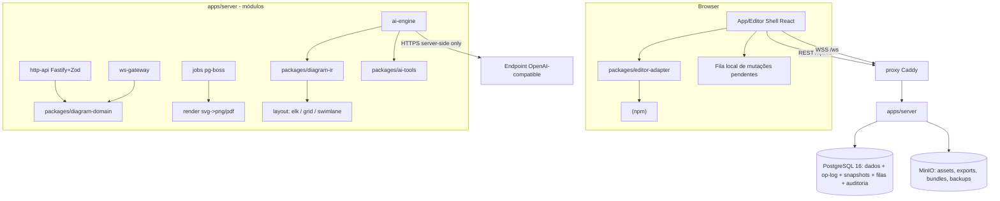

# Architecture Canvas Design

**Spec**: `.specs/features/architecture-canvas/spec.md`
**Context**: `.specs/features/architecture-canvas/context.md`
**Fonte detalhada**: `docs/product-spec.md`
**Status**: Draft

A exploração de abordagens (Yjs vs op-log, ordem do roadmap, topologia) foi conduzida e confirmada com o usuário na fase Specify — as decisões AD-001..AD-006 em `.specs/STATE.md` são restrições ativas deste design e não são reabertas aqui.

---

## Architecture Overview

Monólito modular server-first (AD-003). Um processo Node (`apps/server`) expõe REST + WebSocket e executa jobs via pg-boss (AD-006). O browser roda o shell React com o Excalidraw encapsulado pelo `editor-adapter`; toda mutação vira operação de domínio idempotente confirmada só após commit no PostgreSQL (AD-001). A IA vive inteiramente no servidor: LLM emite `diagram-ir/v1`, o servidor compila com layout determinístico e aplica patches atômicos com preview/undo (AD-004).



**Fluxo de gravação (invariante central):** `onChange` → adapter calcula diff por `elementId`/`version`/`versionNonce` → lote com `clientMutationId` + `baseRevision` → servidor valida sessão/permissão/schema/limites → grava `diagram_operations` em transação → **commit** → ACK → UI marca `Salvo`. Reconciliação de concorrência usa `reconcileElements` (export público do upstream; empate de `version` resolve pelo menor `versionNonce`).

**Fluxo de IA (criação):** prompt → contexto compacto (cena semântica + biblioteca autorizada) → LLM emite IR → validação Zod/JSON Schema → resolução de componentes por `stable_key` → layout determinístico → compilação para elementos Excalidraw → preview em camada fantasma → aprovação → snapshot `pre-ai` + patch atômico contra `sourceRevision`.

---

## Code Reuse Analysis

Greenfield — o reuso é de pacotes upstream verificados (Knowledge Verification Chain: docs oficiais + web):

### Existing Components to Leverage

| Component | Origem | How to Use |
| --- | --- | --- |
| `<Excalidraw/>`, `excalidrawAPI`, `UIOptions`, `renderTopRightUI` | `@excalidraw/excalidraw` | Render no editor shell, exclusivamente via `packages/editor-adapter` |
| `reconcileElements`, `restoreElements` | `@excalidraw/excalidraw` (export público, verificado) | Reconciliação LWW por elemento no cliente e no servidor (AD-001) |
| `exportToSvg` | `@excalidraw/utils` | Render server-side de thumbnails/exports em Node (AD-005; spike F0 valida fontes/jsdom) |
| Layout em camadas | `elkjs` (ELK layered) | Fluxos, microsserviços, event-driven; roda puro em Node |
| Rasterização SVG→PNG | `@resvg/resvg-js` + `sharp` | PNG/PDF server-side sem Chromium; fallback Playwright/Chromium se spike reprovar |
| Fila durável em Postgres | `pg-boss` | Jobs (thumbnails, exports, compaction, backups, IA longa) sem Redis (AD-006) |
| HTTP + validação | `fastify`, `zod`, `fastify-type-provider-zod`, `@fastify/websocket` | REST tipado com OpenAPI gerado + WS no mesmo processo |
| Persistência tipada | `drizzle-orm` + `drizzle-kit` + `pg` | Schema-first, migrations SQL geradas e versionadas |
| Hash de senha | `argon2` | Contas locais (AUTH-01) |
| Sanitização SVG | `isomorphic-dompurify` (profile SVG restrito) | Ícones de biblioteca e uploads (Edge Cases) |
| i18n | `i18next` + `react-i18next` | PT-BR/EN desde o MVP, zero strings hardcoded |
| Testes | `vitest`, `@playwright/test`, `testcontainers` | Matriz de testes (unit/integration/E2E) |

### Integration Points

| System | Integration Method |
| --- | --- |
| PostgreSQL 16 | Drizzle (dados) + pg-boss (filas) + FTS/`pg_trgm` (busca); única fonte da verdade relacional |
| MinIO/S3 | SDK S3 com URLs assinadas curtas; buckets `assets`, `exports`, `backups` criados por `minio-init` |
| Endpoint OpenAI-compatible | `POST {baseUrl}/chat/completions` com tool calling, chamado só pelo `ai-engine` server-side; token cifrado AES-256-GCM |
| Excalidraw upstream | Somente API pública via `editor-adapter`; corpus de fixtures protege upgrades (§14 do documento-fonte) |

---

## Components

### apps/server — módulo `core`
- **Purpose**: bootstrap Fastify, validação de config por Zod (falha com defaults inseguros em produção), logs JSON, OpenTelemetry, health live/ready, graceful shutdown.
- **Location**: `apps/server/src/core/`
- **Interfaces**: `buildServer(config): FastifyInstance`; `loadConfig(env): AppConfig` (lança em default conhecido); `GET /health/live`, `GET /health/ready`.
- **Dependencies**: fastify, zod, pino, observability.
- **Reuses**: `packages/observability`, `packages/shared-contracts`.

### apps/server — módulo `auth`
- **Purpose**: contas locais Argon2id, sessão em cookie HttpOnly/Secure/SameSite=Lax, bootstrap seguro do admin, tickets curtos de WebSocket.
- **Location**: `apps/server/src/modules/auth/`
- **Interfaces**: `POST /auth/login|logout|refresh`, `GET /me`, `issueWsTicket(userId, diagramId): Ticket` (uso único, TTL 30 s).
- **Dependencies**: argon2, `packages/auth` (RBAC policy engine).
- **Reuses**: `packages/auth`.

### apps/server — módulo `workspace`
- **Purpose**: CRUD de workspaces, membros, projetos e diagramas (metadados), lixeira/arquivamento, busca (FTS + pg_trgm).
- **Location**: `apps/server/src/modules/workspace/`
- **Interfaces**: rotas REST §7.1; `authorize(actor, action, resource): Decision` chamada em toda rota.
- **Dependencies**: database, auth.
- **Reuses**: `packages/database`, `packages/auth`.

### apps/server — módulo `diagram-sync`
- **Purpose**: o coração server-first — bootstrap, `operations:batch` idempotente, ACK pós-commit, catch-up por `afterSequence`, reconciliação LWW.
- **Location**: `apps/server/src/modules/diagram-sync/`
- **Interfaces**: `GET /diagrams/{id}/bootstrap`; `POST /diagrams/{id}/operations:batch` → `{acks[], rejected[], currentRevision}`; `GET /diagrams/{id}/operations?afterSequence=`; `applyBatch(tx, batch): AckResult` (única porta de escrita da cena).
- **Dependencies**: diagram-domain, database.
- **Reuses**: `packages/diagram-domain` (validação/reconciliação), constraint única `(diagram_id, client_mutation_id)` para idempotência.

### apps/server — módulo `ws-gateway`
- **Purpose**: canal por diagrama com ticket, broadcast de operações confirmadas, protocolo §7.2 (`hello`, `sync_request/state`, `mutation`, `mutation_ack/rejected`, `presence`, `permission_changed`, `server_draining`, `ping/pong`), limite 256 KB/mensagem.
- **Location**: `apps/server/src/modules/ws-gateway/`
- **Interfaces**: `wss /ws/diagrams/{diagramId}?ticket=`; internamente delega escrita a `diagram-sync.applyBatch` (mesma porta REST/WS — o transporte não muda a semântica).
- **Dependencies**: auth (tickets), diagram-sync.
- **Reuses**: `packages/shared-contracts` (schemas de mensagem).

### apps/server — módulo `snapshot`
- **Purpose**: compactação (100 ops / 5 min / 1 MB), snapshots nomeados e de publicação (imutáveis), restore como nova revisão, diff entre snapshots.
- **Location**: `apps/server/src/modules/snapshot/`
- **Interfaces**: `GET/POST /diagrams/{id}/snapshots`, `POST .../{snapshotId}:restore`, `GET /diagrams/{id}/diff?from=&to=`; job `compactDiagram(diagramId)`.
- **Dependencies**: diagram-sync, jobs, MinIO (cenas grandes em `scene_json_key`).
- **Reuses**: `packages/diagram-domain` (diff estrutural).

### apps/server — módulo `asset`
- **Purpose**: upload em duas fases (`assets:initiate` → URL assinada → `assets:complete` com SHA-256), dedup por checksum no tenant, sanitização SVG, allowlist MIME.
- **Location**: `apps/server/src/modules/asset/`
- **Interfaces**: `POST /diagrams/{id}/assets:initiate|:complete`; invariante: elemento que referencia asset só é ACKado com asset `status=ready` (EDT-06).
- **Dependencies**: MinIO, database.
- **Reuses**: isomorphic-dompurify.

### apps/server — módulo `export`
- **Purpose**: exports `.excalidraw`/SVG/PNG/PDF server-side, bundle `.zip` (cena+assets+metadados+specs+manifest de checksums), bundles em massa por workspace, import com validação e preview, thumbnails.
- **Location**: `apps/server/src/modules/export/`
- **Interfaces**: `POST /diagrams/{id}/exports`, `POST /diagrams/{id}/bundle`, `POST /workspaces/{id}/bundles` (job assíncrono).
- **Dependencies**: jobs, render (exportToSvg+resvg — AD-005), MinIO.
- **Reuses**: `@excalidraw/utils`, `@resvg/resvg-js`.

### apps/server — módulo `ai-engine`
- **Purpose**: pipeline completo de IA — provider config cifrada, runs com máquina de estados, contexto compacto, IR, tools, preview, apply atômico, undo, auditoria e budgets.
- **Location**: `apps/server/src/modules/ai-engine/`
- **Interfaces**: `POST /diagrams/{id}/ai/runs`, `POST /ai/runs/{id}:approve|:cancel`, `GET/POST/PATCH /admin/ai-providers`, `POST /admin/ai-providers/{id}:test`.
- **Estados do run**: `queued → building_context → calling_model → validating → previewing → awaiting_approval → applying → applied | failed | cancelled | rejected`.
- **Dependencies**: diagram-ir, ai-tools, snapshot (pre-ai), jobs (runs longos), provider HTTP client com validação SSRF.
- **Reuses**: `packages/diagram-ir`, `packages/ai-tools`.

### packages/editor-adapter
- **Purpose**: única fronteira com o Excalidraw — render, captura de diffs, aplicação de remotas, round-trip de cena.
- **Location**: `packages/editor-adapter/`
- **Interfaces**:
  - `computeDiff(prev: SceneIndex, next: readonly ExcalidrawElement[]): ElementDelta[]` — por `elementId`/`version`/`versionNonce`/hash canônico;
  - `applyRemote(local, remote): ReconciledScene` — wrapper de `reconcileElements`;
  - `sanitizeAppState(appState): PersistableAppState` — descarta campos efêmeros;
  - `serializeScene/parseScene` — round-trip preservando campos desconhecidos quando seguro;
  - `<EditorSurface/>` — componente React que encapsula `<Excalidraw/>` com `UIOptions` e callbacks isolados.
- **Dependencies**: `@excalidraw/excalidraw` (somente API pública).
- **Reuses**: fixtures de ≥3 versões suportadas em `packages/test-fixtures`.

### packages/diagram-domain
- **Purpose**: modelo de operações, envelope de mutação, validação de limites, reconciliação server-side, diff estrutural entre revisões, tombstones.
- **Location**: `packages/diagram-domain/`
- **Interfaces**:
  - `OperationEnvelope { clientMutationId, baseRevision, actorId, deltas: ElementDelta[] }`;
  - `ElementDelta { elementId, kind: 'upsert'|'delete', element?, version, versionNonce }`;
  - `reconcile(current, deltas): { scene, applied, conflicts }`;
  - `structuralDiff(a, b): { added, removed, moved, modified }`.
- **Dependencies**: zod; sem dependência de React nem do pacote Excalidraw (tipos próprios espelhados no adapter).
- **Reuses**: semântica LWW idêntica ao upstream (menor `versionNonce` vence empates).

### packages/diagram-ir
- **Purpose**: `diagram-ir/v1` — schema, validação, compilador IR→cena, engines de layout, métricas geométricas.
- **Location**: `packages/diagram-ir/`
- **Interfaces**:
  - `IrDocument { version: 'v1', kind: DiagramKind, nodes: IrNode[], containers: IrContainer[], edges: IrEdge[], layoutHints? }`;
  - `IrNode { id, label, componentKey?, semantics?: SemanticMeta }`; `IrContainer { id, label, kind: 'vpc'|'zone'|'boundedContext'|'swimlane'|'trustBoundary'|'group', children }`; `IrEdge { from, to, semantics: { mode: 'sync'|'async'|'data'|'dependency', protocol?, direction, label? } }`;
  - `validateIr(json): IrDocument` (Zod + JSON Schema exportado para o LLM);
  - `compile(ir, library): CompiledScene` — resolve `componentKey` por `stable_key`, aplica layout;
  - `layout(ir): Positioned` — `elk-layered` (fluxos), `grid-zones` (cloud/C4), `swimlane` (negócio), `wireframe` (telas);
  - `geometryMetrics(scene): { overlaps, crossings, truncatedLabels, whitespaceBalance }` — determinístico, roda em CI.
- **Dependencies**: elkjs; medição de texto por tabela de métricas de fonte embarcada (determinística, sem canvas).
- **Reuses**: —

### packages/ai-tools
- **Purpose**: schemas JSON versionados e executores das ferramentas de edição incremental (§8.3), com validação de escopo (todo ID pertence ao diagrama; biblioteca autorizada).
- **Location**: `packages/ai-tools/`
- **Interfaces**: `ToolRegistry.get(name, version): ToolExecutor`; executores puros que recebem `{scene, selection, library, args}` e retornam `AbstractPatch` — nunca tocam banco ou rede.
- **Dependencies**: diagram-domain, diagram-ir.
- **Reuses**: `packages/diagram-ir` para `auto_layout`/`compile_ir`.

### packages/auth
- **Purpose**: policy engine RBAC puro — `can(actor, action, resource)` com papéis §9.2, herança de projeto restringível, matriz testável isolada do transporte.
- **Location**: `packages/auth/`
- **Dependencies**: nenhuma de runtime.

### packages/database
- **Purpose**: schema Drizzle, migrations SQL geradas, cliente pg, helpers de transação e paginação cursor-based.
- **Location**: `packages/database/`
- **Interfaces**: `schema.*` (tabelas §6 emendadas), `withTx(fn)`, `migrate()` (one-shot container).
- **Reuses**: —

### packages/shared-contracts, design-system, observability, test-fixtures
- **Purpose**: tipos REST/WS + problem+json (shared-contracts); tokens CSS e primitivos do shell (design-system); logger/OTel/metrics (observability); corpus de cenas e IRs (test-fixtures: texto, bindings, arrows, imagens, frames, grupos, cenas 1k/5k/10k).
- **Location**: `packages/<nome>/`

### apps/web
- **Purpose**: app shell (navegação, busca, admin), editor shell (breadcrumb, status de save, painel semântico, dock IA), máquina de estados de save (`Salvo|Salvando…|Offline(n)|Conflito|Somente leitura`), fila local pendente (IndexedDB só como cache/fila — nunca fonte da verdade), i18n PT/EN.
- **Location**: `apps/web/`
- **Reuses**: `packages/editor-adapter`, `packages/design-system`, `packages/shared-contracts`, TanStack Query, Zustand (efêmero).

---

## Data Models

Tabelas completas em `docs/product-spec.md` §6 (emendadas por AD-001). Os dois contratos centrais:

```typescript
// diagram_operations — op-log append-only (fonte da verdade incremental)
interface DiagramOperation {
  id: string;                 // uuid
  diagramId: string;
  sequence: number;           // monotônica por diagrama (revision = último sequence aplicado)
  clientMutationId: string;   // UNIQUE (diagram_id, client_mutation_id) → idempotência
  actorId: string;
  baseRevision: number;
  elementsDelta: ElementDelta[]; // JSONB legível (não binário) — auditável, diffável
  operationSummary: { upserts: number; deletes: number; elementIds: string[] };
  createdAt: Date;
}

// diagram_snapshots — materialização compactada + versões nomeadas/publicadas
interface DiagramSnapshot {
  id: string;
  diagramId: string;
  revision: number;           // sequence coberto pelo snapshot
  kind: 'auto' | 'named' | 'published' | 'pre_ai' | 'restore_point';
  name: string | null;
  sceneJsonKey: string;       // objeto no MinIO (cena canônica completa)
  checksum: string;           // sha256 da cena
  createdBy: string;
  immutable: boolean;         // published/pre_ai = true
}
```

**Semântica de revisão:** `diagrams.current_revision` = maior `sequence` commitado. Bootstrap = snapshot mais recente + operações com `sequence > snapshot.revision`. Restore grava operação especial `restore` que referencia o snapshot alvo — histórico posterior intacto (VER-02).

**Relationships-chave:** `ai_runs.source_revision` congela a base do patch (AIE-03); `spec_documents.source_revision` idem para docs (DOC-02); `diagram_elements_meta (diagram_id, element_id)` carrega a semântica fora dos tipos upstream (LIB-02); `presentation_frames.nav_links_json` guarda os links navegáveis (PRS-03).

---

## Error Handling Strategy

| Error Scenario | Handling | User Impact |
| --- | --- | --- |
| PostgreSQL indisponível durante batch | Sem commit → sem ACK; cliente mantém fila e faz retry com backoff | UI fica em `Salvando…`/`Offline — N pendentes`; nunca `Salvo` falso (REC-03) |
| ACK perdido (rede) | Reenvio do mesmo `clientMutationId`; constraint única deduplica; servidor re-ACKa | Transparente; uma única operação durável (EDT-04) |
| Batch com `baseRevision` obsoleta | Servidor responde operações ausentes; cliente reconcilia via `reconcileElements` e reenvia | Merge automático em elementos distintos; `Conflito` visível se mesmo elemento (REC-04/05) |
| MinIO indisponível em insert de imagem | `assets:complete` falha → elemento referenciador não é ACKado | Elemento marcado pendente; sem referência quebrada (EDT-06) |
| Provider IA: timeout/estouro de budget | Run → `failed` com `error_code`; canvas intocado; auditoria registra | Mensagem clara no painel IA; retry manual (Edge Case) |
| IR inválida do LLM | Até 2 repairs com erro estruturado de volta ao modelo; depois `failed` | "Não consegui gerar — tente reformular"; nunca cena corrompida (AIG-01) |
| `baseUrl` de IA em range privado | Rejeição na configuração (validação SSRF na gravação e na chamada) | Erro explicativo ao admin (AIC-03) |
| SVG malicioso em upload | Sanitização DOMPurify profile-SVG; scripts/refs externas removidos ou rejeição | Upload recusado com motivo (Edge Case) |
| Mensagem WS > 256 KB | `mutation_rejected` com código `payload_too_large` | Cliente fragmenta o lote e reenvia (Edge Case) |
| Produção com secret default | `loadConfig` lança na inicialização | Container não sobe; log explica qual variável (FND-03) |

---

## Risks & Concerns

Greenfield — sem código legado; riscos são técnicos e de integração:

| Concern | Location | Impact | Mitigation |
| --- | --- | --- | --- |
| Fidelidade de `exportToSvg` em Node (fontes, jsdom) | `apps/server` módulo export | Thumbnails/PDF divergem do browser | Spike F0 (T9) com fixtures + fontes empacotadas; fallback Chromium headless já desenhado (AD-005) |
| Churn de API do Excalidraw em upgrades | `packages/editor-adapter` | Quebra silenciosa de diff/reconcile | Corpus de fixtures multi-versão + contract tests no CI; upgrade 1 versão por vez (§14) |
| LWW por elemento perde edições simultâneas no MESMO elemento | `diagram-domain.reconcile` | Última escrita vence (variante perdedora só no histórico) | Aceito por AD-001; conflitos detectáveis via op-log; realtime F4 reduz janela; Yjs é ADR futura se doer |
| Medição de texto para layout sem canvas | `packages/diagram-ir` | Labels truncados se métricas divergirem da fonte real | Tabela de métricas gerada a partir das fontes reais empacotadas; `truncatedLabels` métrica de CI trava regressão (AIG-03/07) |
| Throughput pg-boss sob rajadas de export em massa | módulo jobs | Fila atrasada | Métrica de fila + alerta (§11); escala interna torna improvável; migração BullMQ prevista se necessário (AD-006) |
| Compaction concorrente com escrita | módulo snapshot | Snapshot inconsistente | Compaction lê até `sequence` fixo em transação repeatable-read; escritas continuam acima do watermark |
| Prompt injection via conteúdo de elemento | `ai-engine` | Ferramenta indevida acionada | Conteúdo da cena entra como dado serializado (nunca como instrução); tool allowlist por run; eval dedicado (AIE-04) |

---

## Tech Decisions (feature-local; projeto-level já em STATE.md)

| Decision | Choice | Rationale |
| --- | --- | --- |
| ORM/migrations | Drizzle ORM + drizzle-kit (SQL gerado, versionado em `infra/migrations`) | Schema-first tipado, migrations legíveis, zero runtime mágico |
| Layout engine | elkjs (layered) + engines próprios `grid-zones`/`swimlane`/`wireframe` | ELK cobre fluxos direcionados; zonas/raias precisam de regras próprias de qualquer forma |
| Lint/format | Biome | Uma ferramenta, rápida, TS strict complementa |
| Testes | vitest (unit/integration) + testcontainers (PG/MinIO reais) + Playwright (E2E) | Cobre a matriz §17 sem stack paralela |
| HTTP/WS | Fastify + `@fastify/websocket` + fastify-type-provider-zod | Zod único para validação + OpenAPI gerado |
| Node/pnpm | Node 22 LTS, pnpm workspaces + Turborepo | Conforme documento-fonte §5.1 |
| Client state | TanStack Query (server state) + Zustand (efêmero) + IndexedDB (cache/fila apenas) | Conforme §5.1; IndexedDB nunca fonte da verdade |
| Sessão | Cookie de sessão opaco em tabela `sessions` (não JWT) | Revogação imediata, sem estado no cliente, alinha com RBAC dinâmico (AUTH-05) |
| Cifra de token IA | AES-256-GCM com master key via env/secret; interface `KeyProvider` para KMS/Vault futuro | §8.1; troca de backend de chave sem migração de dados |
| WS ticket | Token de uso único TTL 30 s emitido via REST, hash em tabela | Evita cookie em query string; threat model §9.4 |

---

## Test Strategy (alimenta a matriz em tasks.md)

- **Unit (vitest):** `packages/*` — domínio, IR, layout, métricas, RBAC, adapter (com fixtures), redaction. 1:1 com ACs.
- **Integration (vitest + testcontainers):** módulos do server contra PG/MinIO reais — idempotência, ACK pós-commit, restore, IDOR matrix, SSRF.
- **E2E (Playwright):** crash/reload, offline/reconnect, roles, AI preview/undo, presentation (a partir de F1).
- **CI gates:** lint + typecheck + unit + integration + build; E2E críticos em PR, suíte completa nightly.
