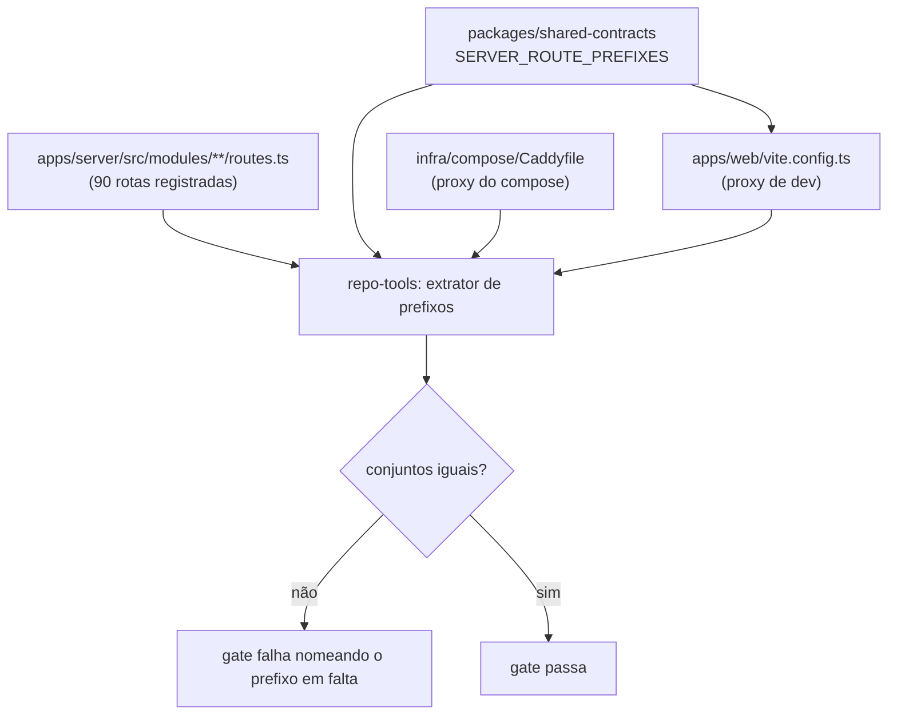

# Contrato de roteamento de borda Design

**Spec**: `.specs/features/edge-routing/spec.md`
**Status**: Draft

---

## Architecture Overview

O produto tem duas bordas HTTP que decidem "isto é API ou é SPA?" e hoje decidem de formas
diferentes e ambas erradas. A correção não é editar as duas bordas: é dar a elas **uma fonte de
verdade comum** e um teste que reprova quando qualquer uma divergir dela.

A fonte é um módulo em `packages/shared-contracts` que exporta a lista de prefixos de rota do
servidor. O Vite importa a lista diretamente. O Caddy não executa JavaScript, então o `Caddyfile`
continua escrito à mão — mas um teste de paridade extrai os prefixos dos três lugares (rotas
registradas, `Caddyfile`, `vite.config.ts`) e exige que os três conjuntos sejam iguais.

A escolha deliberada: **não gerar o `Caddyfile`**. Gerar exigiria um passo de build em `infra/` e um
artefato versionado que ninguém edita mas todo mundo lê. Um teste de paridade dá a mesma garantia,
mantém o arquivo legível e falha com uma mensagem que nomeia o prefixo em falta.

---

## Code Reuse Analysis

### Existing Components to Leverage

| Component | Location | How to Use |
| --------- | -------- | ---------- |
| Extrator de rotas registradas | `tools/repo-tools/src/` (já alimenta `route-inventory.md`) | Reusar para derivar o conjunto de prefixos do servidor, sem segundo mecanismo |
| `packages/shared-contracts` | `packages/shared-contracts/src/` | Adicionar `routePrefixes.ts`; é onde contratos server↔web já vivem |
| Proxy do Vite | `apps/web/vite.config.ts` | Passa a importar a lista em vez de manter a sua própria |
| Job `compose-smoke` do CI | `.github/workflows/ci.yaml` | Estendido por `green-gate` (R20) para provar a borda com login real |

### Integration Points

| System | Integration Method |
| ------ | ------------------ |
| `infra/compose/Caddyfile` | Um `handle` por prefixo, encaminhando a `server:3000`; catch-all para `web:80` permanece |
| `apps/web/vite.config.ts` | `Object.fromEntries` sobre a lista importada, mantendo a entrada de WebSocket com `ws: true` |
| `pnpm -w test:unit` | O teste de paridade roda no pacote `repo-tools`, já incluído no gate |

---

## Components

### `SERVER_ROUTE_PREFIXES`

- **Purpose**: única declaração dos prefixos de caminho que pertencem ao servidor.
- **Location**: `packages/shared-contracts/src/routePrefixes.ts`
- **Interfaces**:
  - `SERVER_ROUTE_PREFIXES: readonly string[]` — `/auth`, `/me`, `/users`, `/workspaces`, `/projects`, `/diagrams`, `/presentations`, `/libraries`, `/share`, `/admin`, `/ai`, `/mcp-tokens`, `/health`, `/metrics`
  - `WS_ROUTE_PREFIX: string` — `/ws`
- **Dependencies**: nenhuma
- **Reuses**: convenção de export do próprio pacote

### Teste de paridade de borda

- **Purpose**: reprovar quando rotas registradas, `Caddyfile` e proxy de dev discordarem.
- **Location**: `tools/repo-tools/src/edgeParity.ts` + `edgeParity.spec.ts`
- **Interfaces**:
  - `prefixesFromRoutes(root): Set<string>` — deriva das rotas registradas
  - `prefixesFromCaddyfile(path): Set<string>` — extrai de cada `handle`
  - `prefixesFromViteConfig(path): Set<string>` — extrai da lista importada
- **Dependencies**: leitura de arquivo; nenhum processo em execução
- **Reuses**: o extrator de rotas que já produz `route-inventory.md`

---

## Decisões e trade-offs

| Decisão | Alternativa descartada | Por quê |
| ------- | ---------------------- | ------- |
| Prefixos numa fonte comum + teste de paridade | Gerar o `Caddyfile` no build | Gerar acrescenta passo de build em `infra/` e um arquivo versionado ilegível; o teste dá a mesma garantia |
| Manter as rotas sem prefixo `/api` | Prefixar as 90 rotas | Quebra `docs/openapi.json`, o MCP, o cliente web inteiro e todo consumidor externo — custo desproporcional ao defeito |
| `/users` como prefixo de `/users:lookup` | Enumerar o caminho completo | Caddy e Vite casam por prefixo; enumerar sufixo com dois-pontos é frágil nos dois |
| Falhar também por regra morta no Caddy | Tolerar prefixo roteado sem rota | Regra morta é como `/api` sobreviveu por semanas |

---

## Riscos

| Risco | Mitigação |
| ----- | --------- |
| O extrator do `Caddyfile` interpretar mal uma sintaxe futura | O teste falha por padrão quando não consegue interpretar (EDGE-12), nunca passa por omissão |
| Alguém adicionar rota sob prefixo novo sem rodar o gate local | O mesmo teste roda no job `Unit tests` do CI |
| A lista divergir de `docs/openapi.json` | O job `capability-audit` já compara OpenAPI com rotas registradas; os dois checam a mesma origem |
