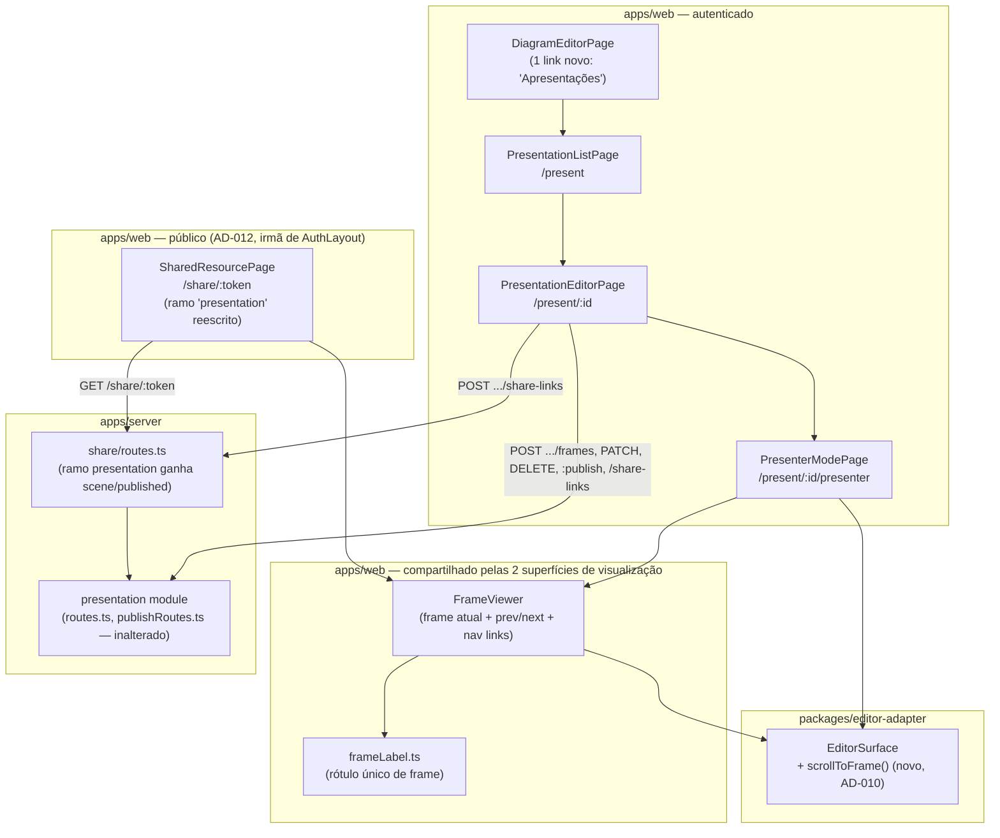

# Apresentação e protótipos navegáveis — Design

**Spec**: `.specs/features/presentation-mode/spec.md`
**Status**: Approved (sessão autônoma — aprovado pelo próprio agente, sem humano disponível)

---

## Contexto lido antes de desenhar

- `.specs/STATE.md` `## Decisions`: AD-001 (LWW op-log), AD-003 (monólito modular — nenhum novo
  app/serviço), AD-004 (IR declarativa, não tocada aqui), AD-006/009 (sem Redis obrigatório — não
  tocado), **AD-010** (handle imperativo `EditorSurfaceHandle` — este design ESTENDE, nunca forka),
  **AD-011** (`AuthProvider`/`useAuth()` única fonte de sessão), **AD-012** (rota pública é irmã da
  rota de layout `AuthLayout`, nunca filha). Nenhuma AD conflita com esta fatia; nenhuma é
  superseded.
- `python3 .claude/skills/tlc-spec-driven/scripts/lessons.py list --status confirmed` → nenhuma
  lição com status `confirmed` na base hoje (todas as 39 lições registradas estão em `candidate`).
  Três lições candidatas de sinal forte foram aplicadas de qualquer forma, por precaução (mesmo
  texto citado no brief desta tarefa): **L-030** (asserir o atributo ARIA nomeado por um AC, não só
  o texto), **L-037** (traçar um AC de nível de TELA para um teste de nível de tela, não a
  callback de um componente filho), **L-038** (asserir que dispensar/trocar de contexto uma
  revelação sensível de fato some do DOM, não só que o callback disparou) — aplicadas nas tasks de
  teste da visão pública e do link one-shot de apresentação.

## Approach

Uma única abordagem viável, sem alternativas reais de arquitetura: o backend das 11 rotas já
existe e está congelado (nenhuma mudança de contrato além da adição pequena e aditiva documentada
no spec). O trabalho desta fatia é inteiramente `apps/web` + um ajuste mínimo em
`apps/server/src/modules/share/routes.ts`. Não há decisão de "qual arquitetura" a explorar — a
única decisão real foi onde cada uma das 4 superfícies mora nas rotas (já registrada em
Assumptions do spec).

---

## Architecture Overview



---

## Code Reuse Analysis

### Existing Components to Leverage

| Component | Location | How to Use |
| --- | --- | --- |
| `EditorSurface` + `EditorSurfaceHandle` | `packages/editor-adapter/src/EditorSurface.tsx` | Reused as-is em todas as 3 telas com canvas (presenter, visão pública, nenhum canvas no editor de apresentação em si — ele só lista frames). Ganha UM método novo, aditivo: `scrollToFrame` |
| `DiagramSyncClient.bootstrap()` | `apps/web/src/sync/syncClient.ts` | Reusado tal qual pelo presenter (cena viva, somente leitura — nunca cria fila de mutação) |
| `createShareLinkClient` | `apps/web/src/share/shareLinkClient.ts` | Ganha um método novo `createForPresentation`, mesmo formato de retorno de `createForDiagram` |
| Padrão de `ShareLinkPanel` (form + lista session-only + aviso one-shot) | `apps/web/src/share/ShareLinkPanel.tsx` | Não importado diretamente (props amarradas a `diagramId`) — o MESMO padrão é reproduzido no editor de apresentação via um componente irmão que compartilha o client, não o componente de UI, para não arriscar acoplar duas telas por uma prop renomeada |
| `<details>`/`<summary>` colapsável | `DiagramEditorPage.tsx` (`LibraryPanel`/`MetadataPanel`/`ShareLinkPanel`) | Mesmo padrão visual para o único acréscimo em `DiagramEditorPage`: um `<details>` "Apresentações" com a lista + link "nova apresentação" |
| `PublicShell` | `apps/web/src/share/PublicShell.tsx` | Reusado tal qual — a visão pública de apresentação continua dentro dele, nenhum shell novo |
| `aria-live="polite"` + `t()` | Convenção de toda fatia anterior (R9/R10/R11) | Reaplicada nas 4 superfícies novas |

### Integration Points

| System | Integration Method |
| --- | --- |
| `GET /presentations?diagramId=` / `GET /presentations/:id` | `presentationClient.ts` novo (mesmo padrão `fetchImpl` injetável de `shareLinkClient.ts`/`memberClient.ts`) |
| `POST/PATCH/DELETE .../frames` | Mesmo `presentationClient.ts` |
| `POST .../:publish`, `.../:export-pdf` | Mesmo `presentationClient.ts` |
| `POST /presentations/:id/share-links` | Método novo em `shareLinkClient.ts` (mesmo arquivo de R11) |
| `GET /share/:token` (ramo `presentation`) | `shareLinkClient.ts`'s `resolve()` — `ResolveResult`'s variante `presentation` ganha `scene`/`published`, mantendo `not_found`/`error`/`diagram` intactos |

---

## Components

### `apps/server/src/modules/share/routes.ts` (mudança de backend, commit próprio)

- **Purpose**: incluir a cena congelada do snapshot publicado no ramo `presentation` de
  `GET /share/:token`, quando a apresentação já foi publicada — fecha a lacuna de protocolo do
  Problem Statement.
- **Mudança**: `ShareModuleDeps` ganha `storage: StorageClient` (já disponível no call site de
  `registerModules.ts`, que já constrói `storage` para `registerPresentationPublishModule`). O
  handler de `GET /share/:token`, no ramo `resourceType === 'presentation'`, passa a: se
  `presentation.publishedSnapshotId` existir, buscar o snapshot (`getSnapshotById`, já exportado
  por `snapshot/snapshots.ts`) e sua cena (`storage.getObject(EXPORT_BUCKET, snapshot.sceneJsonKey)`
  — MESMO par bucket/chave que `getPublishedPresentation` já usa), e retornar `scene` + `published:
  true` junto do que já existe hoje (`presentation`, `frames`). Se não publicada, ou o snapshot
  não resolver, `scene`/`published` ficam ausentes — resposta byte-a-byte igual à de hoje (SHR-27/28
  continuam passando sem alteração nenhuma).
- **Reuses**: `getSnapshotById` (`../snapshot/snapshots.js`), `EXPORT_BUCKET`
  (`../storage/index.js`) — os dois já importados por `presentation/publish.ts`, nenhuma lógica
  nova de leitura de storage é inventada, só reaplicada aqui.
- **Nunca reusa `getPublishedPresentation` diretamente**: essa função LANÇA (404) quando não
  publicada — o comportamento aqui precisa ser "responder 200 sem `scene`", não propagar um erro
  que quebraria a resolução do token inteira. A leitura do snapshot é feita inline, replicando
  só os 3 passos relevantes (get presentation → get snapshot → get object), não chamando a função
  que lança.

### `apps/web/src/presentation/presentationClient.ts` (novo)

- **Purpose**: cliente HTTP dedicado para as 8 rotas do módulo `presentation` (mesmo padrão de
  `shareLinkClient.ts`/`memberClient.ts` — `fetchImpl` injetável, chamadas `fetchImpl(...)`
  literais para o extrator de `repo-tools audit`).
- **Location**: `apps/web/src/presentation/presentationClient.ts`
- **Interfaces**:
  - `list(diagramId): Promise<PresentationSummary[]>`
  - `create(diagramId, name): Promise<CreateResult>`
  - `get(id): Promise<GetResult>`
  - `addFrame(presentationId, input): Promise<AddFrameResult>`
  - `updateFrame(presentationId, frameId, input): Promise<UpdateFrameResult>`
  - `deleteFrame(presentationId, frameId): Promise<DeleteResult>`
  - `reorderFrames(presentationId, updates): Promise<ReorderResult>`
  - `publish(presentationId): Promise<PublishResult>`
  - `exportPdf(presentationId): Promise<ExportResult>`
- **Dependencies**: `fetch`
- **Reuses**: mesmo formato de resultado discriminado por `status` (`'ok' | 'forbidden' |
  'not_found' | 'error'`) que `shareLinkClient.ts` já estabeleceu.

### `apps/web/src/presentation/PresentationListPage.tsx` (novo)

- **Purpose**: rota `/w/:workspaceId/d/:diagramId/present` — lista apresentações do diagrama,
  formulário de criar uma nova.
- **Reuses**: `useAuth()` (AD-011) só indiretamente via bootstrap do diagrama (mesma chamada que
  `DiagramEditorPage` já faz) para decidir `canMutate`.

### `apps/web/src/presentation/PresentationEditorPage.tsx` (novo)

- **Purpose**: rota `/w/:workspaceId/d/:diagramId/present/:presentationId` — CRUD de frames,
  reorder, configuração de nav links, publicar/republicar, criar link de compartilhamento, exportar
  PDF, link para o presenter.
- **Interfaces internas**: nenhuma pública — página de rota.
- **Dependencies**: `presentationClient`, `shareLinkClient` (método novo), `DiagramSyncClient`
  (só para listar os elementos `type: 'frame'` da cena viva, alimentando o seletor de `elementId`
  — nunca abre socket de presença nem fila de mutação, esta página não edita o diagrama).
- **Reuses**: padrão de formulário + lista session-only de `ShareLinkPanel` (reproduzido, não
  importado — ver Code Reuse Analysis), `aria-live` de toda fatia anterior.

### `apps/web/src/presentation/PresenterModePage.tsx` (novo)

- **Purpose**: rota `/w/:workspaceId/d/:diagramId/present/:presentationId/presenter` — tela cheia,
  fora do `AppShell`, cena viva, navegação frame-a-frame.
- **Dependencies**: `EditorSurface` (`viewModeEnabled` sempre `true`), `DiagramSyncClient.bootstrap`
  (somente leitura), `FrameViewer` (componente compartilhado, ver abaixo).
- **Reuses**: `scrollToFrame` do handle AD-010.

### `apps/web/src/presentation/FrameViewer.tsx` (novo, compartilhado)

- **Purpose**: a MESMA lógica de "frame atual, anterior/próximo, links de navegação de protótipo,
  indicador de posição" usada pelo presenter (cena viva) e pela visão pública (cena congelada) —
  nunca duas implementações divergentes (Goals da spec).
- **Interfaces**:
  - Props: `frames: FrameRow[]`, `currentIndex`, `onNavigate(index)`, `renderCanvas(frame):
    ReactNode` (o presenter passa um `EditorSurface` vivo com `scrollToFrame`; a visão pública
    passa um `EditorSurface` com a cena já recortada estaticamente — ver abaixo).
- **Reuses**: `frameLabel.ts`.

### `apps/web/src/presentation/frameLabel.ts` (novo, compartilhado)

- **Purpose**: uma função pura, `frameLabel(frame, position, t)`, usada por `FrameViewer`,
  `PresentationEditorPage` (ao listar alvos de nav link) e `SharedResourcePage` — único lugar que
  decide como um frame sem título é rotulado.

### `apps/web/src/share/SharedResourcePage.tsx` (mudança)

- **Purpose**: o ramo `resourceType === 'presentation'` passa a checar `result.scene`: presente →
  monta `FrameViewer` com a cena recortada por frame no cliente (mesma regra de recorte do
  servidor, replicada em `apps/web/src/presentation/cropSceneForFrame.ts` — uma função pura,
  puro dado de entrada/saída, sem I/O, espelhando `exportPdf.ts`'s `sceneForFrame` do servidor
  byte a byte); ausente → mantém o placeholder atual, sem nenhuma mudança de comportamento (SHR-27/28
  seguem verdes).
- **Reuses**: `FrameViewer`, `frameLabel.ts`, `cropSceneForFrame.ts`.

### `packages/editor-adapter/src/EditorSurface.tsx` (mudança aditiva)

- **Purpose**: `EditorSurfaceHandle` ganha `scrollToFrame(elementId: string | null): void`.
- **Implementação**: filtra a cena local (`previousSceneRef.current`) pelos mesmos critérios de
  `apps/server/src/modules/presentation/exportPdf.ts`'s `sceneForFrame` (`el.frameId === elementId
  || el.id === elementId`); se `elementId` for `null` ou não houver membros, no-op (mesmo fallback
  documentado no servidor). Chama `api.scrollToContent(target, { fitToViewport: true, animate: true
  })` — método real da API imperativa do Excalidraw, declarado localmente na interface estrutural
  `ExcalidrawSceneApi` já existente neste arquivo (mesmo padrão de `updateScene`/`getAppState`, sem
  importar um subpath interno — EDT-07/AD-008).
- **Reuses**: 100% do handle e da cena local já mantidos por este componente — nenhum estado novo.

---

## Data Models

Nenhum modelo novo — o backend já define `PresentationRow`/`FrameRow` (`apps/server/src/modules/
presentation/{presentations,frames}.ts`), reexportados tal qual pelos tipos de cliente novos
(`apps/web/src/presentation/presentationClient.ts`), mesma convenção de `shareLinkClient.ts`'s
`ShareLink` (comentário `Mirrors the server's ... projection`).

```typescript
// apps/web/src/presentation/presentationClient.ts
export interface PresentationSummary {
  id: string;
  diagramId: string;
  name: string;
  publishedSnapshotId: string | null;
  createdAt: string;
  updatedAt: string;
}

export interface FrameSummary {
  id: string;
  presentationId: string;
  elementId: string | null;
  frameId: string | null;
  position: number;
  notes: string | null; // já redigido pelo servidor quando o papel não edita
  navLinksJson: { targetFrameId: string }[];
}
```

`ResolveResult`'s variante `'presentation'` (`apps/web/src/share/shareLinkClient.ts`) ganha dois
campos opcionais, aditivos:

```typescript
| {
    status: 'presentation';
    role: Role;
    presentation: { id: string; name: string };
    frameCount: number;
    frames: readonly FrameSummary[]; // já existia como frameCount only; agora carrega os frames
    scene: readonly SceneElement[] | null; // novo — presente só quando publicada
  }
```

---

## Risks & Concerns

| Risk | Mitigation |
| --- | --- |
| `SharedResourcePage.resolve()` hoje descarta `frames` (só extrai `frameCount`) — mudar isso é uma mudança de shape que os testes SHR-27/28 já fixam por snapshot de mensagem | `frameCount` continua calculado de `frames.length`; a mensagem de placeholder (ramo sem `scene`) fica byte-a-byte igual — testado explicitamente antes de tocar qualquer task de execução |
| `cropSceneForFrame.ts` (cliente) duplica a regra de recorte do servidor (`exportPdf.ts`) — divergência futura é um risco real de manutenção | Cada arquivo carrega um comentário cruzado apontando para o outro (`// mirrors apps/server/.../exportPdf.ts:sceneForFrame — mantenha as duas em sincronia`); a mesma tática de "espelho documentado" que `shareLinkClient.ts` já usa para `toPublicShareLink` |
| `scrollToContent` não está na interface `ExcalidrawSceneApi` local hoje — se a versão de Excalidraw não o expuser, `scrollToFrame` vira no-op silencioso | Chamada defensiva (`api.scrollToContent?.(...)`), com teste que verifica a chamada acontece quando o mock a expõe; ausência do método nunca lança, só deixa de mover o viewport (degradação aceitável, mesmo espírito de AD-009's "sem Redis, degrade explícito") |
| `PresentationEditorPage` precisa da cena viva só para listar frames `type: 'frame'` — abrir um `DiagramSyncClient` completo (com fila/presença) seria over-fetch | Usa só `bootstrap()` (leitura), nunca instancia `PresenceClient` nem `mutationQueue` — página não edita o diagrama, só lê a lista de frames existentes |
| Cobertura de teste do sensor de discriminação (mutation testing) para `cropSceneForFrame`/regra de recorte — é lógica pura, fácil de mutar silenciosamente (`===` → `!==`, `\|\|` → `&&`) | Tasks incluem testes que cobrem cada ramo do OR (elementId casando por `frameId` E por `id`), aplicando L-001 (lição confirmada de rodadas anteriores sobre condições OR) mesmo sem estar marcada `confirmed` no momento |

---

## Interação entre as 4 superfícies (fluxo ponta a ponta)

1. `DiagramEditorPage` → link "Apresentações" → `PresentationListPage` (`/present`).
2. Criar apresentação → `PresentationEditorPage` (`/present/:id`): montar frames, reordenar,
   configurar nav links.
3. Publicar (`:publish`) → criar link de compartilhamento (`POST .../share-links`) → URL
   `${origin}/share/${token}`.
4. Visitante anônimo abre a URL → `SharedResourcePage` → ramo `presentation` com `scene` → `FrameViewer`.
5. Dentro do workspace, qualquer `diagram:read` abre "Apresentar" a partir de
   `PresentationEditorPage` → `PresenterModePage` (`/present/:id/presenter`) → cena viva, mesmo
   `FrameViewer`.
