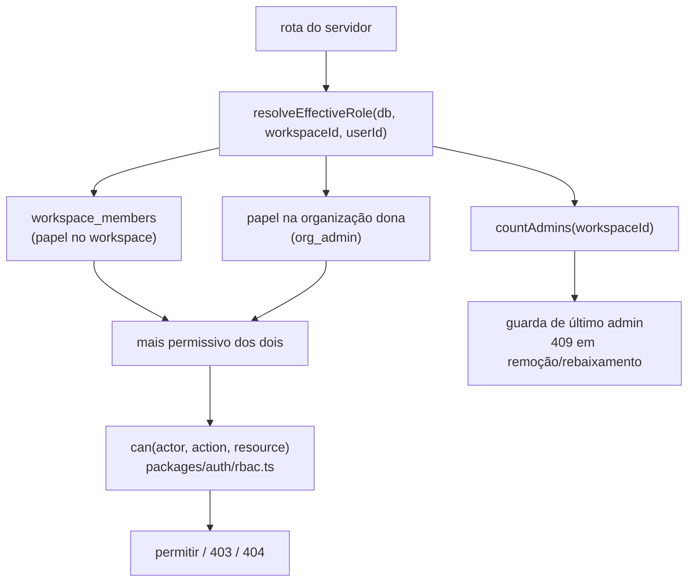

# Clareza de RBAC Design

**Spec**: `.specs/features/rbac-clarity/spec.md`
**Status**: Draft

---

## Architecture Overview

Hoje o papel de um ator sobre um workspace é resolvido por `requireMembership`, que lê apenas
`workspace_members`. É por isso que `org_admin` não tem efeito nenhum fora do workspace onde tem
linha — o papel de organização nunca é consultado. A correção é introduzir **uma única função de
resolução de papel efetivo** e fazer toda rota passar por ela, em vez de espalhar uma segunda
consulta.

`packages/auth/rbac.ts` continua puro (sem banco, sem HTTP) — muda apenas a tabela de grants:
`reviewer` ganha `comment:resolve`, `viewer` perde. Toda a lógica de "de onde vem o papel" fica no
servidor, onde o banco está.

---

## Code Reuse Analysis

### Existing Components to Leverage

| Component | Location | How to Use |
| --------- | -------- | ---------- |
| `can()` / `ROLE_GRANTS` | `packages/auth/src/rbac.ts` | Ajuste da tabela de grants; a assinatura de `can()` não muda |
| `requireMembership` | `apps/server/src/modules/workspace/` | Passa a delegar a `resolveEffectiveRole`; nenhuma rota muda de forma |
| `rbac-matrix.int.spec.ts` | `apps/server/src/modules/workspace/` | Matriz existente estendida com a dimensão de papel de organização |
| `recordAuditEvent` | módulo de auditoria | Já usado por `workspace.created`; reusado para mudança de papel e remoção |
| `WorkspaceMembersPage` | `apps/web/src/nav/` | Já tem convite, troca de papel e remoção gated em `workspace:manage_members` |
| `memberClient` | `apps/web/src/nav/memberClient.ts` | O convite volta a funcionar quando R18 rotear `/users` — nenhum código de cliente muda |

### Integration Points

| System | Integration Method |
| ------ | ------------------ |
| Toda rota com `requireMembership` | Substituição interna por `resolveEffectiveRole`; contrato HTTP inalterado |
| Banco | Nenhuma migração: nenhum valor de enum muda, só os grants em código |
| `apps/web` | Nova exibição de papel efetivo, alimentada pela resposta já existente de membros |

---

## Components

### `resolveEffectiveRole`

- **Purpose**: devolver o papel de maior privilégio que um ator tem sobre um workspace, considerando associação direta e papel de organização.
- **Location**: `apps/server/src/modules/workspace/`
- **Interfaces**:
  - `resolveEffectiveRole(db, workspaceId, userId): Promise<Role | null>` — `null` quando não há acesso algum
- **Dependencies**: `workspace_members`, organização dona do workspace
- **Reuses**: as mesmas consultas que `requireMembership` já faz, mais uma para o papel de organização

### Guarda de último administrador

- **Purpose**: recusar remoção ou rebaixamento que deixaria o workspace sem administrador.
- **Location**: `apps/server/src/modules/workspace/`
- **Interfaces**:
  - `assertWorkspaceKeepsAdmin(db, workspaceId, change): Promise<void>` — lança conflito `409`
- **Dependencies**: contagem de administradores dentro da mesma transação da alteração
- **Reuses**: o helper de erro `conflict()` já usado no módulo

---

## Decisões e trade-offs

| Decisão | Alternativa descartada | Por quê |
| ------- | ---------------------- | ------- |
| Manter cinco papéis e diferenciar grants | Reduzir para três papéis | Reduzir exige migração destrutiva de enum e quebra o contrato público da API |
| `org_admin` sem linha em `workspace_members` | Materializar associação para todo `org_admin` | Materializar cria linhas que ninguém gerencia e desincroniza quando a organização muda |
| Guarda dentro da transação da alteração | Verificação antes, alteração depois | Duas remoções concorrentes passariam pela verificação e ambas removeriam |
| `org_admin` da organização conta como admin do workspace | Só `workspace_admin` conta | Um workspace com `org_admin` na organização nunca está órfão; contar diferente bloquearia operações legítimas |
| Mais permissivo entre papel de workspace e de organização | Papel de workspace sempre vence | Um `org_admin` rebaixado a `viewer` num workspace perderia o poder que o nome promete |

---

## Riscos

| Risco | Mitigação |
| ----- | --------- |
| Uma rota continuar usando o caminho antigo de resolução | RBAC-05 exige uma única função; o gate reprova se `requireMembership` mantiver consulta própria |
| Ampliação acidental de acesso ao dar poder cross-workspace | A matriz de RBAC passa a cobrir os cinco papéis contra todas as ações, incluindo ator sem associação |
| `viewer` perder `comment:resolve` quebrar fluxo existente | Nenhum consumidor atual depende disso; a AC RBAC-04 preserva `comment:create` para `viewer` |
| Guarda de último admin bloquear operação legítima | RBAC-10 permite remover o último `workspace_admin` quando existe `org_admin` na organização |
