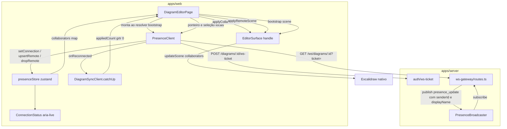
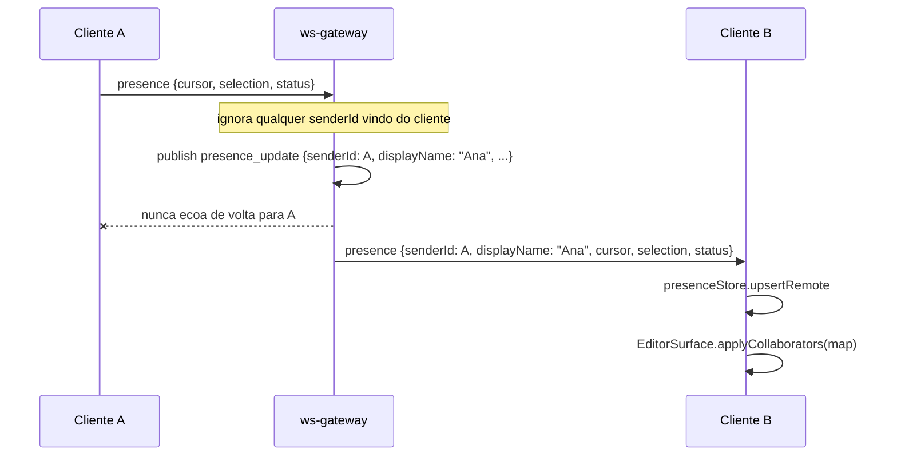

# Presença em tempo real no editor — Design

**Spec**: `.specs/features/realtime-presence/spec.md`
**Status**: Approved

Decisões de projeto ativas que restringem este design (`.specs/STATE.md`): **AD-001** (LWW por
elemento, nunca merge granular), **AD-002** (coedição simultânea não é desta fatia — só presença),
**AD-003** (monólito modular: nenhum processo novo), **AD-008** (nada server-side importa
`@excalidraw/excalidraw` por valor), **AD-009** (`PresenceBroadcaster` injetável, servidor funciona
sem Redis), **AD-010** (canvas só recebe cena remota pelo handle imperativo `applyRemoteScene`),
**AD-011** (`useAuth()` é a única fonte de identidade no `apps/web`). Nenhuma é superada aqui —
esta fatia é o primeiro consumidor real de AD-009 no frontend e o segundo caller de AD-010.

Lições confirmadas carregadas: `lessons.py list --status confirmed` devolveu vazio (só há
candidates). As candidates mais relevantes desta frente foram aplicadas mesmo assim: **L-027** (AC
de duas cláusulas precisa de asserção nas duas — LIVE-01/02, LIVE-09, LIVE-13 são todas de duas
cláusulas) e **L-030** (AC que nomeia atributo ARIA precisa afirmar o atributo — LIVE-25).

---

## Approach exploration

Três bifurcações reais nesta fatia. Cada uma foi decidida antes dos Components.

### Fork 1 — Como o `senderId` vira uma identidade exibível

| | **A — Servidor manda `displayName` junto (escolhida)** | **B — Cliente resolve contra a lista de membros** | **C — Só `senderId`, sem nome** |
| --- | --- | --- | --- |
| Mecanismo | Na abertura do socket o gateway resolve `users.display_name` do ator do ticket, uma vez, e carimba `senderId` + `displayName` em todo `presence_update` publicado por aquela conexão. A retransmissão repassa os dois. | O relay manda só `senderId`; o editor busca `GET /workspaces/:id/members` e monta um índice `userId → displayName`. | Cursor remoto sem nome; só cor derivada do `senderId`. |
| Custo por mensagem | Zero. Uma query por conexão. | Zero por mensagem, mas uma chamada REST a mais por sessão de editor. | Zero. |
| Dependências novas no editor | Nenhuma. | O editor passa a precisar do `workspaceId` do diagrama (tem via rota, mas passa a acoplar presença a membros) e de um segundo cliente REST. | Nenhuma. |
| Falha ao resolver identidade | Impossível: `users.display_name` é `NOT NULL` e o ator do ticket sempre existe. | Real: qualquer identidade fora da página de membros carregada (ou um `403` na rota) deixa o cursor anônimo. | N/A. |
| Superfície de dado exposta | `displayName` de quem já é membro do mesmo workspace — exatamente o que `GET /workspaces/:id/members` já entrega a qualquer papel. | Igual. | Menor. |
| Valor entregue | Nome no cursor, nativo do Excalidraw (`Collaborator.username`). | Igual, com mais peças móveis. | Cursores anônimos e indistinguíveis além da cor. |

**Escolhida: A.** É a mais barata em tempo de execução, a única sem modo de falha de resolução, e
não acopla a superfície de presença à superfície de membros (R4). C foi descartada porque a spec
(LIVE-13) exige nome no cursor e a paleta de cores é finita — duas pessoas colidindo de cor num
diagrama ficariam indistinguíveis.

### Fork 2 — Throttle do cursor local

| | **A — Trailing throttle de 50 ms com relógio/timer injetáveis (escolhida)** | **B — Batching por `requestAnimationFrame`** | **C — Sem throttle** |
| --- | --- | --- | --- |
| Taxa de mensagens | ≤20/s, independente de hardware. | Amarrada ao refresh da tela: 60/s num monitor comum, 120/s num de 120 Hz. | Uma por evento `mousemove` do navegador — centenas por segundo. |
| Testabilidade neste repo | Direta: o mesmo padrão de injeção (`scheduleRetryTimer`) que `DiagramSyncClient` já usa. | jsdom não implementa `requestAnimationFrame` com semântica de frame; exigiria shim no `vitest.setup.ts` e um fake de tempo por cima. | N/A. |
| Última posição preservada | Sim (trailing: o timer dispara com a posição mais recente observada). | Sim. | Sim, trivialmente. |
| Custo no servidor | O servidor **não tem throttle nenhum** (confirmado em `routes.ts`'s case `'presence'`: publica direto). Toda mensagem que sai daqui é fan-out para N assinantes. | Igual, com 3-6× mais mensagens. | Inaceitável. |

**Escolhida: A.** O throttle é 100% responsabilidade do cliente porque o servidor não tem nenhum, e
o critério que importa é custo de rede, não suavidade de frame — 20 Hz é indistinguível a olho para
um cursor remoto. A injeção de timer é a convenção já estabelecida do repo.

### Fork 3 — Como testar WebSocket em `apps/web` (não existe nada hoje)

| | **A — Construtor injetável + fake escrito à mão (escolhida)** | **B — devDependency `mock-socket`** | **C — Servidor `ws` real no teste** |
| --- | --- | --- | --- |
| Dependências novas | Nenhuma. | Uma (`mock-socket`), só de teste. | Uma (`ws`) + porta TCP real em teste de unidade. |
| Superfície a simular | 5 membros (`send`, `close`, `readyState`, `onopen`/`onmessage`/`onclose`/`onerror` ou `addEventListener`). | A mesma, escondida atrás de uma API própria a aprender. | Nenhuma — é real. |
| Controle determinístico do teste | Total: o teste decide exatamente quando o socket abre, recebe e fecha. | Bom, mas o timing de `mock-socket` é assíncrono por design. | Ruim: precisa de espera por rede mesmo em loopback; testes de reconexão viram flaky. |
| Alinhamento com o repo | Idêntico ao `fetchImpl` de `DiagramSyncClient`/`AuthProvider`/`AiDock`/`WorkspaceMembersPage`. | Nenhum precedente. | `apps/server` usa `ws` de verdade nos testes de integração — e é lá que o teste real de dois clientes vive (LIVE-01..05). |

**Escolhida: A** para `apps/web`, **C** para `apps/server`. A cobertura de "dois clientes reais
trocando presença" (LIVE-01/02/03) fica no teste de integração do servidor, que já tem a
infraestrutura (`wsGateway.int.spec.ts` abre sockets `ws` reais contra um Fastify em porta 0).
O `apps/web` testa o seu próprio lado com um fake determinístico, sem dependência nova.

---

## Architecture Overview

Um cliente novo (`PresenceClient`) é o dono do socket e de todos os temporizadores. Ele não conhece
React nem Excalidraw: fala protocolo de wire de um lado e emite estado tipado do outro. Um store
zustand (`presenceStore`) guarda o mapa de colaboradores remotos e o estado da conexão. A ponte para
o canvas é o mesmo handle imperativo de AD-010, agora com um segundo método.



Fluxo de uma atualização de presença, ponta a ponta:



---

## Code Reuse Analysis

### Existing Components to Leverage

| Component | Location | How to Use |
| --- | --- | --- |
| `parseWsMessage` / `WS_PROTOCOL_VERSION` / `wsEnvelopeSchema` | `packages/shared-contracts/src/ws-messages.ts`, `ws-envelope.ts` | Import direto no `apps/web` (o pacote **já é dependência** de `apps/web`, hoje não usado por nenhum arquivo). O cliente valida toda mensagem recebida com a mesma função que o servidor usa — zero parsing paralelo |
| `presencePayloadSchema` | `packages/shared-contracts/src/ws-messages.ts` | Estendido (aditivo, dois campos opcionais). Único lugar onde a forma do payload é declarada, nas duas direções |
| `PresenceEvent` / `PresenceBroadcaster` | `apps/server/src/modules/ws-gateway/presence.ts` | Inalterado. `PresenceEvent` é `Record<string, unknown>` e já carrega `senderId`; `displayName` entra pelo mesmo caminho sem mudança de tipo |
| `resolveDiagramMembership` | `apps/server/src/modules/auth/ws-ticket.ts` | Referência de padrão de query; a resolução de `display_name` é uma query nova de uma linha sobre `users` |
| `DiagramSyncClient.catchUp()` / `bootstrap()` / `onReconcile` | `apps/web/src/sync/syncClient.ts` | `catchUp()` ganha seu primeiro caller. `onReconcile` (hoje nunca passado por ninguém) vira o gatilho do refetch de cena |
| `fetchImpl` injection | `apps/web/src/sync/syncClient.ts:41-42` | Template exato para `WebSocketImpl` |
| `EditorSurfaceHandle.applyRemoteScene` | `packages/editor-adapter/src/EditorSurface.tsx:110-115` | Reusado tal como está para o catch-up; serve de template para o método novo `applyCollaborators` |
| `createSaveStatusStore` / `saveStatusTranslationKey` | `apps/web/src/sync/saveStatus.ts` | Padrão exato de "store zustand + função de chave i18n por estado" que `presenceStore` copia |
| `aiDockStatusTranslationKey` | `apps/web/src/ai-dock/aiDockStore.ts:30` | Mesmo padrão de mapeamento fase → chave i18n |
| `WorkspaceMembersPage.a11y.spec.tsx` | `apps/web/src/nav/` | Template do arquivo `*.a11y.spec.tsx`: `jest-axe`, `seriousOrCriticalViolations`, foco de teclado, `aria-live`, teste no locale `en` |
| `wsGateway.int.spec.ts` | `apps/server/src/modules/ws-gateway/` | Template do teste de integração com sockets `ws` reais: seed de usuário/workspace/diagrama, emissão de ticket via `app.inject`, `app.listen({port: 0})` |

### Integration Points

| System | Integration Method |
| --- | --- |
| `ws-gateway` (servidor) | Duas mudanças cirúrgicas em `routes.ts`: resolver `displayName` uma vez após consumir o ticket; parar de remover `senderId` no `send()` do relay |
| `shared-contracts` | Dois campos opcionais em `presencePayloadSchema`. Contrato cross-package: os dois lados mudam no mesmo commit; grep confirmou que os únicos consumidores são o próprio `ws-messages.ts` e o `ws-gateway` |
| `editor-adapter` | Um método aditivo no handle imperativo existente (`applyCollaborators`), zero mudança nas props ou no comportamento atual |
| `DiagramEditorPage` | Um `useEffect` novo (ciclo de vida do `PresenceClient`), um handler de ponteiro no wrapper do canvas, reuso do `selection` que já é levantado por `onSelectionChange` |
| Vite dev proxy | `/ws` adicionado a `API_ROUTE_PREFIXES` com `{ws: true}` |
| `docs/capability-map.yaml` | A entrada "Colaboração em tempo real e presença" ganha `ui_surface` e perde `status: backend-only` |

---

## Components

### `presencePayloadSchema` (extensão, `packages/shared-contracts`)

- **Purpose**: carregar a identidade do remetente na retransmissão sem quebrar a direção cliente→servidor.
- **Location**: `packages/shared-contracts/src/ws-messages.ts`
- **Interfaces**: `senderId: uuidSchema.optional()`, `displayName: z.string().min(1).optional()` acrescidos ao objeto existente.
- **Dependencies**: nenhuma nova.
- **Reuses**: `uuidSchema` (`ids.ts`).
- **Por que opcional**: `wsPayloadSchemaByType` tem **uma** entrada por tipo de mensagem, não uma por direção. Obrigatório quebraria todo `presence` enviado pelo cliente. A garantia de que o servidor nunca confia nesses campos vindos do cliente é estrutural: o `case 'presence'` do gateway monta o evento publicado a partir de `actorId`/`displayName` da conexão e nunca lê `message.payload.senderId`.

### `ws-gateway` (extensão, `apps/server`)

- **Purpose**: resolver o nome de exibição uma vez por conexão e parar de descartar a identidade na retransmissão.
- **Location**: `apps/server/src/modules/ws-gateway/routes.ts`
- **Interfaces**:
  - `resolveDisplayName(db, userId): Promise<string>` — `select display_name from users where id = ?`, uma vez logo após o `hello`.
  - `handlePresenceEvent(event)` passa a repassar `senderId` e `displayName` do evento.
  - `case 'presence'` passa a publicar `displayName` junto do `senderId` já publicado hoje.
- **Dependencies**: `users` (`@arch-canvas/database`).
- **Reuses**: `PresenceEvent` (sem mudança de tipo — é `Record<string, unknown>`), o filtro de auto-eco (`event.senderId === actorId`) já existente, o filtro que descarta `mutation_broadcast` (mantido intacto: coedição continua fora de escopo por AD-002).
- **Nota de sequência**: a resolução do nome é `await`-ada **antes** de assinar o broadcaster, para que nenhum evento seja retransmitido com `displayName` indefinido. O handler de `message` continua sendo registrado sincronicamente, antes de qualquer `await`, como hoje.

### `PresenceClient` (novo, `apps/web`)

- **Purpose**: dono único do socket, do throttle, do heartbeat de idle, da poda e do backoff de reconexão.
- **Location**: `apps/web/src/presence/presenceClient.ts`
- **Interfaces**:
  - `constructor(options: PresenceClientOptions)`
  - `connect(): void` — emite ticket e abre socket.
  - `close(): void` — fecha, cancela timers, e impede qualquer reconexão posterior.
  - `sendCursor(cursor: {x: number; y: number}): void` — throttled (trailing, 50 ms).
  - `sendSelection(selection: readonly string[]): void` — imediato.
- **Options**: `{diagramId, selfUserId, store, fetchImpl?, WebSocketImpl?, now?, setTimeoutImpl?, clearTimeoutImpl?, onReconnected?}`
- **Dependencies**: `presenceStore`, `parseWsMessage`, `WS_PROTOCOL_VERSION`.
- **Reuses**: a forma de injeção de `DiagramSyncClient` (`fetchImpl`, `scheduleRetryTimer`) e o backoff exponencial limitado (`Math.min(1000 * 2 ** attempt, 30_000)`), replicado com a mesma fórmula.
- **Regras internas**:
  - Nunca envia com `readyState !== OPEN` (LIVE-11).
  - Toda mensagem recebida passa por `parseWsMessage`; qualquer erro é descartado em silêncio (Edge Case).
  - Um `close` com código `4403`/`4413` (constantes do servidor) **não** reagenda reconexão (Edge Case).
  - Um único intervalo de 15 s cuida das duas varreduras temporais: emitir `idle` local após 60 s sem movimento (LIVE-12) e podar remotos sem mensagem há 90 s (Edge Case).

### `presenceStore` (novo, `apps/web`)

- **Purpose**: estado observável de conexão e de colaboradores remotos.
- **Location**: `apps/web/src/presence/presenceStore.ts`
- **Interfaces**: `createPresenceStore()`, `presenceStatusTranslationKey(phase)`, ações `setConnection(phase)`, `upsertRemote(entry)`, `dropRemote(senderId)`, `pruneRemotes(before)`, `clearRemotes()`.
- **Dependencies**: `zustand`.
- **Reuses**: forma exata de `createSaveStatusStore` + `saveStatusTranslationKey`.

### `collaboratorColor` (novo, `apps/web`)

- **Purpose**: cor estável e determinística por `senderId`.
- **Location**: `apps/web/src/presence/collaboratorColor.ts`
- **Interfaces**: `collaboratorColor(senderId: string): {background: string; stroke: string}`
- **Dependencies**: nenhuma.
- **Reuses**: nada — é uma função pura de ~10 linhas (hash FNV-1a de 32 bits → índice numa paleta fixa de 8 pares).

### `ConnectionStatus` (novo, `apps/web`)

- **Purpose**: indicador textual do estado da conexão, anunciado para leitor de tela.
- **Location**: `apps/web/src/presence/ConnectionStatus.tsx`
- **Interfaces**: `<ConnectionStatus store={presenceStore} />`
- **Dependencies**: `react-i18next`, `presenceStore`.
- **Reuses**: o padrão do `<p data-testid="save-status">` já presente em `DiagramEditorPage` (texto por chave i18n derivada do estado), acrescido de `aria-live="polite"`.

### `EditorSurface` (extensão, `packages/editor-adapter`)

- **Purpose**: repassar o mapa de colaboradores para o Excalidraw nativo.
- **Location**: `packages/editor-adapter/src/EditorSurface.tsx`
- **Interfaces**: `EditorSurfaceHandle.applyCollaborators(collaborators: ReadonlyMap<string, RemoteCollaborator>): void`
- **Dependencies**: nenhuma nova.
- **Reuses**: o `apiRef`/`useImperativeHandle` que `applyRemoteScene` e `insertLibraryItem` já usam. O tipo estrutural local `ExcalidrawSceneApi` ganha `collaborators?` em `updateScene` e `elements` vira opcional — mesma técnica de tipagem estrutural que o arquivo já aplica para não importar subpath interno do Excalidraw (EDT-07/AD-008).
- **Por que aditivo e não uma prop**: `updateScene` é imperativo; uma prop reativa forçaria um `useEffect` de sincronização dentro do adapter e um re-render do `<Excalidraw/>` por movimento de cursor remoto. O handle é a mesma decisão que AD-010 já registrou para cena remota.

### `DiagramEditorPage` (extensão, `apps/web`)

- **Purpose**: ciclo de vida e fiação.
- **Location**: `apps/web/src/diagram/DiagramEditorPage.tsx`
- **Interfaces**: sem mudança de props.
- **Reuses**: o `selection` já levantado por `onSelectionChange` (não duplica a fiação), o `clientRef` do `DiagramSyncClient`, o `editorSurfaceRef` de AD-010.
- **Fiação**: `onPointerMove` no wrapper do canvas converte coordenadas de cliente para coordenadas de cena e chama `sendCursor`; um `useEffect` assina o `presenceStore` e chama `applyCollaborators` a cada mudança do mapa; `onReconnected` chama `catchUp()`, e o `onReconcile` do `DiagramSyncClient` (com `appliedCount > 0`) dispara `bootstrap()` + `applyRemoteScene`.

---

## Data Models

### Payload `presence` na wire (estendido, aditivo)

```typescript
interface PresencePayload {
  cursor?: { x: number; y: number } | null
  selection?: string[]
  status: 'active' | 'idle'
  /** Preenchido pelo servidor na retransmissão; ignorado quando vem do cliente. */
  senderId?: string
  /** Preenchido pelo servidor na retransmissão; ignorado quando vem do cliente. */
  displayName?: string
}
```

### `RemoteCollaborator` (novo, `packages/editor-adapter`)

Fatia estrutural do `Collaborator` do Excalidraw que este projeto realmente preenche. Declarada
localmente pelo mesmo motivo que `SceneElement`: o tipo do upstream só existe em subpath interno.

```typescript
export interface RemoteCollaborator {
  pointer?: { x: number; y: number; tool: 'pointer' }
  selectedElementIds?: Record<string, true>
  username?: string
  color?: { background: string; stroke: string }
  id?: string
}
```

### `PresenceState` (novo, `apps/web`)

```typescript
type ConnectionPhase = 'connecting' | 'connected' | 'disconnected'

interface RemotePresence {
  senderId: string
  displayName: string
  cursor: { x: number; y: number } | null
  selection: string[]
  lastSeenAt: number
}

interface PresenceState {
  connection: ConnectionPhase
  remotes: Record<string, RemotePresence>
  setConnection: (phase: ConnectionPhase) => void
  upsertRemote: (entry: RemotePresence) => void
  dropRemote: (senderId: string) => void
  pruneRemotes: (staleBefore: number) => void
  clearRemotes: () => void
}
```

**Relationships**: `remotes` nunca contém o próprio usuário (filtrado no `PresenceClient`, não no
store). `ConnectionPhase` mapeia 1:1 para `presence.status.<phase>` no i18n.

---

## Error Handling Strategy

| Error Scenario | Handling | User Impact |
| --- | --- | --- |
| `POST /diagrams/:id/ws-ticket` responde não-2xx ou falha por rede | Nenhum socket é aberto; estado vai a `disconnected`; reconexão reagendada com backoff | Indicador mostra "Desconectado"; edição e salvamento REST continuam funcionando normalmente |
| Upgrade recusado com HTTP 401 (ticket inválido/expirado/reusado) | O socket dispara `error`/`close`; tratado como qualquer queda: novo ticket na próxima tentativa | Igual ao anterior; se recuperável, reconecta sozinho |
| Fechamento com código de política `4403`/`4413` | Reconexão **não** é reagendada | Indicador fica em "Desconectado" de forma estável, sem loop de tentativa contra uma rejeição determinística |
| Mensagem WS malformada, de tipo desconhecido, ou `presence` sem `senderId` | Descartada em silêncio; conexão intacta | Nenhum |
| `catchUp()` rejeita | Erro capturado; conexão permanece; canvas inalterado | Nenhum; a próxima reconexão tenta de novo |
| `bootstrap()` do catch-up rejeita | Erro capturado; canvas inalterado, sem propagar para a árvore React | Nenhum; a cena continua na revisão local até o próximo catch-up |
| `presence.publish` falha no servidor | Já tratado hoje: `log.warn`, best-effort (AD-009/CLB-04) | Uma atualização de presença perdida; nada durável é afetado |
| Colaborador remoto some sem avisar (aba fechada) | Poda por `lastSeenAt` > 90 s | O cursor fantasma desaparece em até ~105 s (poda a cada 15 s) |
| `WebSocket` indisponível no ambiente (SSR, jsdom sem shim) | `WebSocketImpl` ausente → `connect()` não faz nada e mantém `disconnected` | Editor funciona sem presença, exatamente como hoje |

---

## Risks & Concerns

| Concern | Location (file:line) | Impact | Mitigation |
| --- | --- | --- | --- |
| **Tech debt / bug real**: o relay descarta a identidade do remetente, tornando a presença inutilizável por qualquer cliente | `apps/server/src/modules/ws-gateway/routes.ts:171-175` | Feature inconstruível como está | É a primeira task desta onda (LIVE-01..05), com teste de integração de dois sockets reais |
| **Test gap**: `catchUp()` não tem nenhum caller em `apps/web/src`, então o laço reconexão→canvas nunca foi exercitado ponta a ponta | `apps/web/src/sync/syncClient.ts:144-155` | O caminho de convergência anunciado no roadmap nunca rodou de verdade | LIVE-20..22 fecham o laço com teste de integração de página |
| **Config gap**: o dev proxy do Vite não cobre `/ws`, então a feature não funciona em `make web-dev` | `apps/web/vite.config.ts:11` | Feature invisível em desenvolvimento local, sem erro óbvio | Task própria adicionando `/ws` com `{ws: true}` |
| **Contrato cross-package**: `presencePayloadSchema` é compartilhado entre `apps/server` e (agora) `apps/web`; mudar um lado sozinho quebra o outro em runtime, não em build | `packages/shared-contracts/src/ws-messages.ts:63-68` | Regressão silenciosa numa onda futura | Campos opcionais (compatível para trás nas duas direções) + o teste de integração de dois sockets vira o guardião do contrato |
| **Custo de rede não limitado pelo servidor**: nenhum throttle server-side; um cliente malcomportado inunda todos os assinantes | `apps/server/src/modules/ws-gateway/routes.ts:323-336` | Fan-out ilimitado por diagrama | Fora de escopo consertar no servidor nesta fatia (seria mudança de política de rede, não de presença). Mitigado no cliente pelo throttle de 50 ms; risco registrado aqui explicitamente |
| **Piso de cobertura do `apps/web`**: `vitest.config.ts` trava `lines/statements` em 56.54% e `functions` em 72.5%; código novo sem teste derruba o gate | `apps/web/vitest.config.ts:20-28` | Gate vermelho no fim da onda | Toda task de `apps/web` traz seus testes junto (co-location obrigatória da matriz) |
| **`updateScene` com `collaborators` num `<Excalidraw/>` mockado**: os testes deste repo substituem o componente real | `packages/editor-adapter/src/EditorSurface.spec.tsx:32-54` | A passagem é verificada contra um spy, não contra render real de cursor | Aceito e disclosed: o contrato verificado é "o mapa correto chega a `updateScene`". Renderizar cursor de verdade exigiria canvas real, que nenhum teste deste repo faz (mesma limitação já registrada para `applyRemoteScene`) |

---

## Tech Decisions

| Decision | Choice | Rationale |
| --- | --- | --- |
| Identidade na wire | `senderId` + `displayName`, ambos opcionais, preenchidos só pelo servidor | Fork 1 acima; decidido com o usuário antes do Specify |
| Origem do `displayName` | `users.display_name`, resolvido uma vez por conexão | Uma query por conexão em vez de uma por mensagem ou uma chamada REST extra por editor |
| Throttle | Trailing, 50 ms, timer injetável | Fork 2 acima |
| Teste de WS no `apps/web` | Construtor injetável + fake à mão, zero dependência nova | Fork 3 acima |
| Onde vive o teste de "dois clientes" | `apps/server` (integração, sockets `ws` reais) | É onde o comportamento realmente mora e onde a infraestrutura já existe |
| Cursor remoto | `updateScene({collaborators})` nativo do Excalidraw | API pública do `@excalidraw/excalidraw@0.18.1` (`SceneData.collaborators`), sem subpath interno — compatível com EDT-07/AD-008 |
| Ponte para o canvas | Segundo método no handle imperativo existente | AD-010; evita re-render do `<Excalidraw/>` a cada movimento de cursor remoto |
| Cor do colaborador | FNV-1a do `senderId` → paleta fixa de 8 pares | Determinística sem coordenação; nenhum campo de cor existe no servidor |
| Detecção de saída | `status: 'idle'` (60 s) + poda por `lastSeenAt` (90 s) | Usa só campos que o protocolo já tem; nenhuma mensagem nova inventada |
| Convergência de cena na reconexão | `catchUp()` como sonda, `bootstrap()` como busca, `applyRemoteScene` como aplicação | `catchUp()` devolve `{sequence, clientMutationId}`, não elementos — confirmado em código |

> **Decisões de nível de projeto**: nenhuma nova AD é criada por esta onda. A extensão do handle de
> `EditorSurface` é exatamente o que AD-010 já prescreve ("todo consumidor futuro que precisar
> refletir estado remoto no canvas deve reusar este mesmo handle"), e a presença continua sem
> persistência (CLB-04) e sem Redis obrigatório (AD-009), ambos inalterados.
