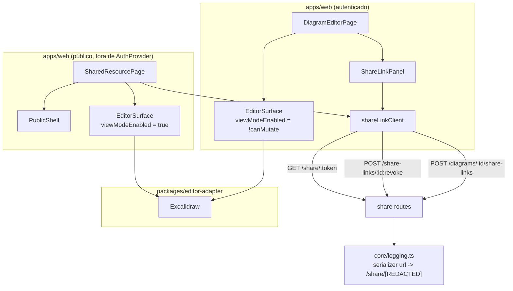

# Compartilhamento externo por link — Design

**Spec**: `.specs/features/share-links/spec.md`
**Status**: Approved

---

## Approach exploration

Três decisões de arquitetura desta onda merecem alternativas escritas. As duas primeiras não têm
precedente nenhum no projeto; a terceira toca um pacote compartilhado.

### 1. Onde `/share/:token` fica em relação a `AuthProvider` / `ProtectedRoute`

Todas as rotas de `apps/web` hoje vivem dentro de um único `<AuthProvider>` montado em
`AppRoutes` (`apps/web/src/App.tsx:40`). `/login` é a única sem `ProtectedRoute`, mas mesmo ela
depende de `AuthProvider` (usa `useAuth`). `/share/:token` é a primeira rota que precisa funcionar
para quem nunca vai ter sessão.

| | **A — Fora de `AuthProvider`, via rota de layout sem path (recomendada)** | **B — Dentro de `AuthProvider`, fora de `ProtectedRoute`** |
| --- | --- | --- |
| Diff em `App.tsx` | `<Routes>` passa a ter dois ramos: `/share/:token` solta, e um `<Route element={<AuthLayout/>}>` sem path (que monta `AuthProvider` com `<Outlet/>`) envolvendo todas as rotas de hoje, inalteradas | Uma linha: mais um `<Route path="/share/:token" element={<SharedResourcePage/>}/>` dentro do `<Routes>` atual |
| Requisições de uma visita anônima | Só `GET /share/:token` | `GET /me` (401) → `POST /auth/refresh` (401) → assenta `anonymous`, e só então `GET /share/:token`. Dois round-trips inúteis, com cookies de sessão enviados a rotas de auth por quem não tem sessão |
| Risco de redirect | Zero, estruturalmente: `ProtectedRoute` é o único lugar do app que redireciona, e nada acima da rota o monta | Zero na leitura atual (`ProtectedRoute` é quem redireciona, `AuthProvider` só resolve estado), mas a garantia passa a depender de `AuthProvider` continuar sem redirecionar — uma invariante mantida por convenção, não por estrutura |
| Dependências implícitas quebradas | Nenhuma verificada: i18n é um singleton inicializado por side-effect (`apps/web/src/i18n/index.ts`), sem relação com sessão; `AppShell` (que é dependente de sessão) não é montado por nenhuma das duas opções | Nenhuma |
| Risco de React Router | Rota de layout sem path com `<Outlet/>` é padrão documentado de v6/v7, já usado neste próprio arquivo (`/` é uma rota-pai com `<Outlet/>` desde R3). Um único `<Routes>`, sem `<Routes>` aninhado nem path splat | Nenhum |
| Custo | Uma indireção nova (`AuthLayout`) de 3 linhas | Nenhum |

**Escolhida: A.** A diferença que decide não é o custo (ambos são baratos) e sim o que a estrutura
garante sozinha. SHR-13 exige que a página pública não emita `GET /me`/`POST /auth/refresh`: em A
isso é impossível por construção, em B é uma promessa que depende de ninguém mexer em
`AuthProvider`. A rota pública é a superfície de menor confiança do produto inteiro — vale ser a
que menos depende de convenção. `AuthLayout` também deixa explícito no código, pela primeira vez,
que `AuthProvider` é um escopo e não um envelope global.

### 2. Escopo da visão pública de apresentação

`GET /share/:token` é uma rota só e devolve duas formas. Para `resourceType: 'presentation'`, o
servidor já devolve `{presentation, frames}` com `notes` redigido quando o papel do link não pode
editar. R12 (`presentation-mode`, 2 ondas) ainda não existe.

| | **A — Placeholder honesto (recomendada)** | **B — Visualizador mínimo de frames** | **C — Tratar como 404** |
| --- | --- | --- | --- |
| O que a página faz | Mostra o nome da apresentação, a contagem de frames, e diz que a visualização ainda não está disponível | Lista os frames em ordem de `position`, com navegação anterior/próximo | Devolve a mesma tela de "link inválido" |
| Fidelidade ao dado | `FrameRow` não tem título nenhum (`id`, `presentationId`, `elementId`, `frameId`, `position`, `notes`, `navLinksJson`) — só há posição para mostrar | Uma lista de "Frame 1, Frame 2, Frame 3" sem conteúdo: `elementId` aponta para um elemento de uma cena que esta resposta nem devolve | Mente: o link é válido |
| Sobreposição com R12 | Nenhuma — R12 substitui o placeholder inteiro | Alta: navegação de frames é literalmente o escopo declarado de R12, e seria reescrita | Nenhuma |
| Risco de vazamento | Nenhum: nada de `notes`/`navLinksJson` chega à tela | Precisa de disciplina explícita para nunca renderizar `notes` (que vem preenchido quando o papel do link é `editor`) | Nenhum |

**Escolhida: A.** B constrói R12 mal dentro de R11 e ainda assim não consegue mostrar nada de útil,
porque a resposta não traz cena nem título de frame. C mente sobre o estado do link, o que é pior do
que uma tela honesta. A criação de link de apresentação pela interface fica fora desta onda pelo
motivo registrado na spec: não existe superfície de apresentação em `apps/web` de onde tirar um
`presentationId`, e um método de cliente sem chamador seria código morto.

### 3. Forma da prop de somente-leitura em `EditorSurface`

| | **A — `viewModeEnabled?: boolean` repassada (recomendada)** | **B — `readOnly?: boolean` traduzida internamente** |
| --- | --- | --- |
| Superfície | `EditorSurfaceProps` ganha o mesmo nome que `ExcalidrawProps` já usa (`viewModeEnabled?: boolean`, confirmado em `@excalidraw/excalidraw@0.18.1`, `dist/types/excalidraw/types.d.ts:436`) | Nome próprio do projeto, mapeado para `viewModeEnabled` dentro do componente |
| Ambiguidade | Nenhuma: quem lê a prop sabe exatamente o que ela faz no Excalidraw | "Read-only" sugere também bloquear `applyRemoteScene`/`insertLibraryItem`, que continuam funcionando (são caminhos programáticos, não interação do usuário) |
| Compatibilidade | Aditiva e opcional; ausente = `undefined` = default do Excalidraw = comportamento atual byte a byte | Igual |

**Escolhida: A.** O vocabulário do upstream já resolve o problema; um nome próprio criaria uma
tradução a manter e sugeriria uma semântica mais larga do que a implementada.

---

## Architecture Overview

Duas superfícies novas em `apps/web` (um painel dentro do editor autenticado, uma página pública
inteira), um cliente HTTP dedicado, uma prop aditiva no pacote compartilhado `editor-adapter`, e um
serializer de log no servidor. Nenhum contrato de rota muda.



Roteamento resultante em `App.tsx`:

```
<Routes>
  /share/:token                      -> SharedResourcePage          (sem AuthProvider)
  <Route element={AuthLayout}>       -> AuthProvider + <Outlet/>
      /login                         -> LoginPage
      /                              -> ProtectedRoute + AppShell   (+ 4 filhas de R3/R4)
      /w/:workspaceId/d/:diagramId   -> ProtectedRoute + DiagramEditorPage
      /w/.../inventory               -> ProtectedRoute + InventoryPage
  </Route>
</Routes>
```

---

## Code Reuse Analysis

### Existing Components to Leverage

| Component | Location | How to Use |
| --- | --- | --- |
| `memberClient.ts` | `apps/web/src/nav/memberClient.ts` | Copiar o padrão exato: `createXClient(fetchImplOption?)`, união discriminada por status, `fetchImpl(...)` literal em cada chamada (o extrator de `repo-tools audit` só reconhece `fetch(`/`fetchImpl(` literais) |
| `EditorSurface` | `packages/editor-adapter/src/EditorSurface.tsx` | Estender com `viewModeEnabled?: boolean`, aditiva; reusar tal como está nas duas superfícies |
| `AiDock` / `LibraryPanel` gating | `apps/web/src/diagram/DiagramEditorPage.tsx:171-188` | Mesma variável `canMutate` já resolvida do bootstrap, mesma convenção de `<details>` colapsado na coluna lateral |
| `WorkspaceMembersPage` | `apps/web/src/nav/WorkspaceMembersPage.tsx` | Padrão de `aria-live="polite"` com `data-testid`, guarda de requisição em voo (`inviteInFlight`), e mensagens por chave de i18n |
| Rota-pai com `<Outlet/>` | `apps/web/src/App.tsx:43-55` | `AuthLayout` usa a mesma mecânica, só que sem `path` |
| `buildLoggerOptions` serializers | `apps/server/src/core/logging.ts:83-103` | Adicionar a redação dentro do serializer `req` existente, sem trocar a estratégia de log |
| `logging.spec.ts` | `apps/server/src/core/logging.spec.ts:11-15` | `devConfigWithCapturedLogs()` já existe e captura o stream do Pino — reusar tal como está |
| `i18n` singleton | `apps/web/src/i18n/index.ts` | Funciona fora de `AuthProvider` (é um `init` por side-effect, sem dependência de sessão) — a visão pública usa `useTranslation()` normalmente |

### Integration Points

| System | Integration Method |
| --- | --- |
| `share` module (servidor) | Consumido como está; nenhuma rota, schema ou permissão muda |
| `core/logging.ts` | Único ponto tocado no servidor; muda o valor logado, nunca `request.url` |
| `packages/editor-adapter` | Prop opcional nova; consumidores existentes (`DiagramEditorPage`) seguem compilando sem mudança |
| `App.tsx` | Uma rota nova e uma rota de layout; nenhuma rota existente muda de path ou de guard |

---

## Components

### `redactSensitiveUrl` + serializer `url` (servidor)

- **Purpose**: Tirar o token de share e o ticket de WebSocket do valor de URL que vai para o log.
- **Location**: `apps/server/src/core/logging.ts`
- **Interfaces**:
  - `redactSensitiveUrl(url: string): string` — substitui o segmento seguinte a `/share/` e o valor do parâmetro `ticket` por `[REDACTED]`; devolve o resto intacto.
- **Dependencies**: nenhuma (função pura, sem import novo).
- **Reuses**: a constante `REDACT_CENSOR` já existente (`'[REDACTED]'`), para o censor ser um só no arquivo.
- **Notas**: chamada apenas dentro do serializer `req` (`url: redactSensitiveUrl(request.url)`). `request.url` em si nunca é reatribuído — roteamento, `instance` do problem+json (`core/server.ts:266,279,287`) e métricas (`core/server.ts:117,142`, que usam `routeOptions.url`, o padrão da rota) seguem inalterados. Exportada para teste unitário direto além do teste de ponta a ponta pelo stream capturado.

### `EditorSurface` (extensão)

- **Purpose**: Permitir desabilitar a edição local do canvas.
- **Location**: `packages/editor-adapter/src/EditorSurface.tsx`
- **Interfaces**:
  - `EditorSurfaceProps.viewModeEnabled?: boolean` — repassada direto para `<Excalidraw viewModeEnabled={...}/>`.
- **Dependencies**: `@excalidraw/excalidraw` (já dependência deste pacote).
- **Reuses**: nada novo; é uma prop a mais no mesmo `<Excalidraw/>`.
- **Notas**: ausente = `undefined` = default do Excalidraw. `applyRemoteScene`/`insertLibraryItem` continuam funcionando em modo de visualização — são caminhos programáticos, e a visão pública simplesmente não os chama.

### `shareLinkClient`

- **Purpose**: Cliente HTTP dedicado das 3 rotas consumidas.
- **Location**: `apps/web/src/share/shareLinkClient.ts` (pasta nova, mesmo nível de `ai-dock/`, `nav/`, `export/`)
- **Interfaces**:
  - `createShareLinkClient(fetchImpl?: typeof fetch): ShareLinkClient`
  - `createForDiagram(diagramId, role, expiresAt): Promise<CreateShareLinkResult>` — `POST /diagrams/:id/share-links`
  - `revoke(shareLinkId): Promise<RevokeResult>` — `POST /share-links/:id:revoke`
  - `resolve(token): Promise<ResolveResult>` — `GET /share/:token`
- **Dependencies**: `@arch-canvas/auth` (tipo `Role`, já dependência de `apps/web` desde R3).
- **Reuses**: forma e convenções de `memberClient.ts` — união discriminada por status, `fetchImpl(...)` literal.

### `ShareLinkPanel`

- **Purpose**: Criar e revogar links a partir do editor autenticado.
- **Location**: `apps/web/src/share/ShareLinkPanel.tsx`
- **Interfaces**: props `{ diagramId: string; canMutate: boolean; fetchImpl?: typeof fetch }`
- **Dependencies**: `shareLinkClient`, `react-i18next`.
- **Reuses**: gating por `canMutate` igual ao de `AiDock`; região `aria-live="polite"` com `data-testid` igual à de `WorkspaceMembersPage`; guarda de requisição em voo igual a `inviteInFlight`.
- **Notas**: guarda os links criados nesta montagem em `useState` local (não existe rota de listagem — ver spec). Cada item guarda `{id, role, expiresAt, url, revoked}`; ao revogar, `url` deixa de ser renderizada.

### `PublicShell`

- **Purpose**: O chrome mínimo da página pública — cabeçalho com o nome do produto e o seletor de idioma, nada mais.
- **Location**: `apps/web/src/share/PublicShell.tsx`
- **Interfaces**: props `{ children: ReactNode }`
- **Dependencies**: `react-i18next`.
- **Reuses**: nada de `AppShell` — `AppShell` renderiza logout e navegação de workspace, ambos dependentes de sessão (`useAuth`/`useLogout`), e reusá-lo arrastaria `AuthProvider` de volta para a rota pública. `LanguageSwitcher` (`apps/web/src/app-shell/LanguageSwitcher.tsx`) é reusado se e somente se não depender de `useAuth` (confirmar na task; se depender, o seletor fica de fora).

### `SharedResourcePage`

- **Purpose**: A visão pública que o link abre.
- **Location**: `apps/web/src/share/SharedResourcePage.tsx`
- **Interfaces**: props `{ fetchImpl?: typeof fetch }`; lê `:token` de `useParams`.
- **Dependencies**: `shareLinkClient`, `PublicShell`, `EditorSurface`, `react-i18next`, `react-router-dom`.
- **Reuses**: `EditorSurface` com `viewModeEnabled` fixo em `true`.
- **Notas**: quatro estados — carregando, diagrama (canvas), apresentação (placeholder), inválido. Nunca monta `DiagramSyncClient`, `createMutationQueue` nem `AiDock`.

### `AuthLayout` + `AppRoutes` (extensão)

- **Purpose**: Tornar `AuthProvider` um escopo de rota em vez de um envelope global, e registrar `/share/:token` fora dele.
- **Location**: `apps/web/src/App.tsx`
- **Interfaces**: `AuthLayout(): JSX.Element` — `<AuthProvider><Outlet/></AuthProvider>`.
- **Dependencies**: `react-router-dom`.
- **Reuses**: a mesma mecânica de rota-pai com `<Outlet/>` que `/` já usa desde R3.

### `DiagramEditorPage` (extensão)

- **Purpose**: Fechar a lacuna de somente-leitura do editor autenticado e hospedar o painel.
- **Location**: `apps/web/src/diagram/DiagramEditorPage.tsx`
- **Interfaces**: nenhuma pública nova.
- **Dependencies**: `ShareLinkPanel`.
- **Reuses**: `canMutate` já resolvido do bootstrap — passa a alimentar também `viewModeEnabled={!canMutate}` no `EditorSurface`, além dos gates de painel que já alimenta.

---

## Data Models

Nenhum modelo de dados novo — a tabela `share_links` e todas as rotas já existem. Os tipos abaixo
são espelhos client-side das respostas que o servidor já devolve, nunca invenções.

```typescript
// Espelha toPublicShareLink() (apps/server/src/modules/share/routes.ts:61) — nunca inclui tokenHash.
interface ShareLink {
  id: string
  resourceType: 'diagram' | 'presentation'
  resourceId: string
  role: Role
  expiresAt: string
  revokedAt: string | null
  createdBy: string
  createdAt: string
}

// A resposta 201 de POST /diagrams/:id/share-links — `token` é revelado uma vez e nunca mais.
type CreateShareLinkResult =
  | { status: 'created'; shareLink: ShareLink; token: string }
  | { status: 'forbidden' }   // 403: teto de papel, ou sem diagram:mutate
  | { status: 'error' }

type RevokeResult =
  | { status: 'revoked'; shareLink: ShareLink }
  | { status: 'forbidden' }   // 403
  | { status: 'not_found' }   // 404
  | { status: 'error' }

// GET /share/:token — sem sessão. 404 cobre inválido, expirado e revogado, indistinguíveis.
type ResolveResult =
  | { status: 'diagram'; role: Role; scene: readonly SceneElement[]; revision: number }
  | { status: 'presentation'; role: Role; presentation: { id: string; name: string }; frameCount: number }
  | { status: 'not_found' }
  | { status: 'error' }
```

`frameCount` é derivado de `frames.length` no cliente: o restante de `frames` (incluindo `notes` e
`navLinksJson`) é descartado no limite do cliente, para SHR-28 ser verdade por construção e não por
disciplina de renderização.

**Estado local do painel** (nunca persistido, nunca no `localStorage`):

```typescript
interface CreatedLink {
  id: string
  role: Role
  expiresAt: string
  url: string          // `${origin}/share/${token}` — a única cópia do token que existe no cliente
  revoked: boolean
}
```

---

## Error Handling Strategy

| Error Scenario | Handling | User Impact |
| --- | --- | --- |
| Criação devolve `403` (teto de papel ou sem `diagram:mutate`) | `{status:'forbidden'}` → mensagem específica de teto de papel | "Você não pode conceder um papel acima do seu." Nenhum link entra na lista |
| Criação devolve `404` ou `5xx` | `{status:'error'}` → mensagem genérica | Falha genérica anunciada em `aria-live` |
| Criação `201` sem `token` no corpo | Tratada como `{status:'error'}` | Falha genérica; nunca uma URL incompleta na tela |
| Expiração no passado | Bloqueada antes da requisição | Mensagem própria; nenhuma requisição emitida |
| Revogar devolve `403`/`404` | `{status:'forbidden'}`/`{status:'not_found'}` → falha anunciada | O link continua exibido como ativo (a tela não mente sobre o estado do servidor) |
| Revogar o mesmo link duas vezes | A rota é idempotente e devolve `200` — a tela trata como sucesso | Sem erro nem item duplicado |
| `GET /share/:token` devolve `404` | Estado "inválido" único, sem distinguir inválido/expirado/revogado | Uma mensagem só, espelhando a decisão IDOR do servidor |
| `GET /share/:token` falha por rede | Mesmo estado "inválido"/falha genérica, sem retry automático | Sem loop de requisição |
| `resourceType: 'presentation'` | Estado de placeholder | Nome da apresentação + "visualização ainda não disponível" |
| Cena vazia (`scene: []`) | Canvas vazio, nunca o estado de inválido | Vê um diagrama em branco, que é o dado real |

---

## Risks & Concerns

| Concern | Location (file:line) | Impact | Mitigation |
| --- | --- | --- | --- |
| Token de share em texto claro no log estruturado de produção | `apps/server/src/core/logging.ts:87` | Todo acesso a um link válido grava uma credencial utilizável no log de acesso; qualquer pessoa com acesso ao log herda todos os links compartilhados | Serializer `url` com `redactSensitiveUrl` (componente acima), com teste que falha se a redação for removida (SHR-23/24) |
| Ticket de WebSocket em texto claro na query logada | `apps/server/src/modules/ws-gateway/routes.ts:51,96,135` (`GET /ws/diagrams/:diagramId?ticket=`) | Mesma classe de vazamento, credencial de uso único | Mesmo serializer, mesma task, teste próprio (SHR-25) |
| `EditorSurface` sem modo somente-leitura hoje | `packages/editor-adapter/src/EditorSurface.tsx:188-214` | Um `reviewer`/`viewer` autenticado edita localmente algo que o servidor vai rejeitar no flush — trabalho perdido em silêncio; na visão pública seria um sinal de confiança falso | Prop `viewModeEnabled` aditiva, ligada nas duas superfícies (SHR-18/19/22) |
| Não existe rota de listagem de share links | `apps/server/src/modules/share/routes.ts:137-262` | A tela não consegue mostrar links criados antes, nem revogá-los — um link esquecido só morre pela expiração | Escopo declarado na spec (Out of Scope) e visível na própria tela (SHR-08). Não é regressão desta onda; nenhuma rota nova é criada aqui |
| `AppShell` é inteiramente dependente de sessão (`useAuth`/`useLogout`) | `apps/web/src/app-shell/AppShell.tsx` | Reusar `AppShell` na página pública arrastaria `AuthProvider` de volta e quebraria SHR-13 | `PublicShell` separado, mínimo, sem nenhum import de `auth/` |
| `POST /presentations/:id/share-links` continua `pending-product` no `repo-tools audit` | `docs/route-inventory.md` | O roadmap listava 4 rotas para R11 e esta onda consome 3 | Documentado na spec (Out of Scope + Rotas consumidas) e no Success Criteria, que fala explicitamente em 3 rotas. R12 consome a quarta |
| `expiresAt` é obrigatório e sem "nunca" (assimétrico com tokens MCP) | `apps/server/src/modules/share/routes.ts:41-44` | Um usuário acostumado ao token MCP pode esperar a opção | Assimetria deliberada e preservada; a interface simplesmente não oferece a opção, sem mudar o contrato |

---

## Tech Decisions

| Decision | Choice | Rationale |
| --- | --- | --- |
| Onde `/share/:token` mora no roteamento | Fora de `AuthProvider`, via rota de layout sem path (`AuthLayout`) | Ver "Approach exploration" 1 — SHR-13 vira garantia estrutural em vez de convenção |
| Escopo da visão pública de apresentação | Placeholder honesto; criação de link de apresentação adiada para R12 | Ver "Approach exploration" 2 — não há dado suficiente na resposta para um visualizador útil, e construir um duplicaria R12 |
| Forma da prop de somente-leitura | `viewModeEnabled?: boolean`, repassada | Ver "Approach exploration" 3 — usa o vocabulário do upstream, sem tradução a manter |
| Como o token sai do log | Serializer `url` próprio, não `redact` do Pino | `redact` é por caminho de campo e não casa substring dentro do valor de um campo; tirar `url` do log inteiro perderia o dado operacional que faz o log servir para alguma coisa |
| `frames` na visão pública | Descartado no cliente, guardando só `frames.length` | SHR-28 (nunca renderizar `notes`) passa a ser verdade por construção; a redação do servidor continua sendo a primeira linha de defesa, esta é a segunda |
| Onde os componentes moram | `apps/web/src/share/` (pasta nova) | Convenção de pasta por feature já estabelecida (`ai-dock/`, `export/`, `history/`, `library/`, `nav/`) |
| Links criados ficam em estado local | `useState`, sem `localStorage` | Não há rota de listagem, e o token nunca é recuperável nem pelo servidor — persistir só guardaria um `id` sem utilidade |

> **Decisão de nível de projeto.** `AuthLayout` estabelece que `AuthProvider` é um escopo de rota,
> não um envelope global de `apps/web`: toda superfície pública futura (R12's visão pública de
> apresentação é a próxima) entra como irmã da rota de layout, nunca dentro dela. Isso muda o
> alcance de AD-011 (que hoje diz "`AuthProvider` montado acima de todas as rotas") sem contradizer
> sua substância — `useAuth()` continua sendo a única fonte de verdade de sessão para toda
> superfície autenticada. Registrada como `AD-012` em `.specs/STATE.md`.

---

## Tasks preview (não vinculante — a rodada de Tasks decide o breakdown final)

Ordem de dependência: o serializer de log (servidor) e a prop de `EditorSurface` (`editor-adapter`)
são independentes entre si e de todo o resto; `shareLinkClient` e as chaves de i18n também são
independentes; `ShareLinkPanel` depende de cliente + i18n; `SharedResourcePage` depende de cliente +
i18n + `PublicShell` + prop de `EditorSurface`; a fiação de rota depende de `SharedResourcePage`; a
fiação de `DiagramEditorPage` depende de `ShareLinkPanel` + prop de `EditorSurface`.
