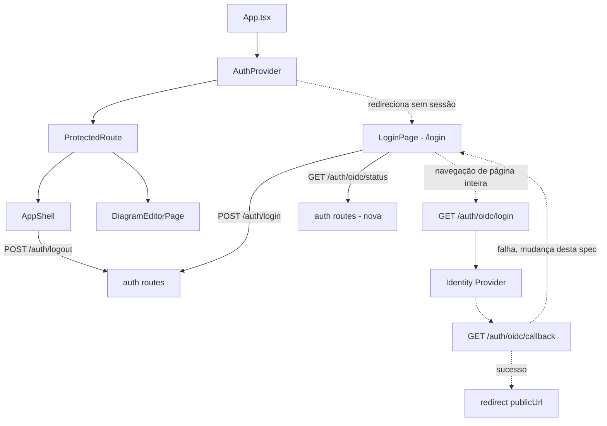
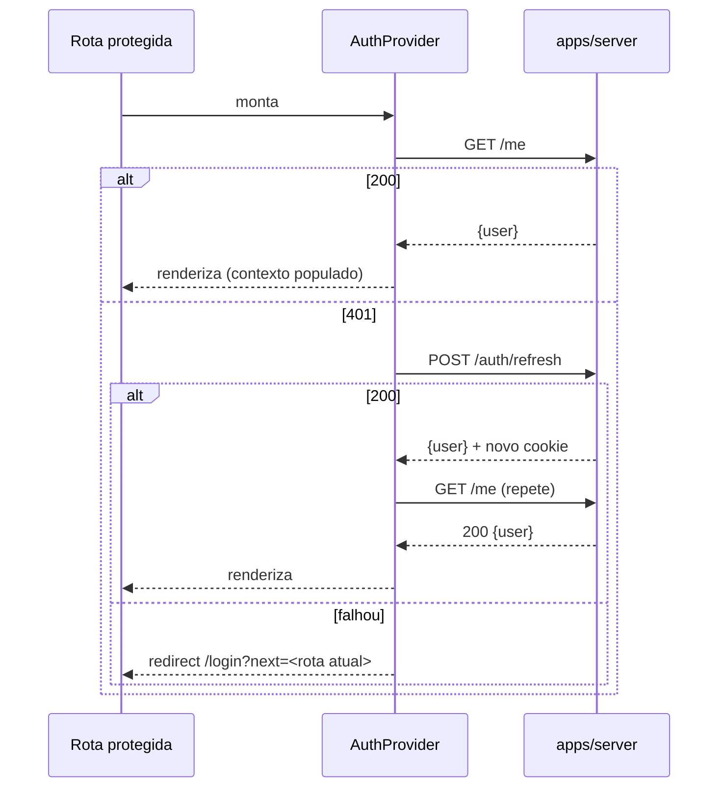

# Entrada no produto (login e SSO) — Design

**Spec**: `.specs/features/sso-sign-in/spec.md`
**Status**: Approved

---

## Architecture Overview

Um `AuthProvider` novo — `React.Context` + hook `useAuth()` — é a única fonte de verdade de sessão
no frontend, montado uma vez no topo de `App.tsx`, acima do `<Routes>`. Ele resolve exatamente o
gap que a pesquisa encontrou: hoje nada em `apps/web` reage a um `401` de `/me`. Não há uma segunda
abordagem viável a explorar aqui — `react-router-dom` v7 está em uso só com `<Routes>`/`<Route>`
puros (nenhum `createBrowserRouter`/loader em lugar nenhum do código), então introduzir o padrão de
data-loaders só para esta fatia seria uma mudança de arquitetura maior do que a spec pede; Context
é a extensão mínima consistente com o que já existe.



Fluxo de guarda de rota:



---

## Code Reuse Analysis

### Existing Components to Leverage

| Component | Location | How to Use |
| --- | --- | --- |
| `can()` (RBAC) | `@arch-canvas/auth` | Não usado aqui — login não decide papel, só identidade. Mantido fora, evita acoplamento desnecessário. |
| Padrão de rota Zod + `RouteSchemaMap` | `apps/server/src/modules/auth/routes.ts:79-87` | `GET /auth/oidc/status` segue o mesmo `routeSchemas` já exportado por este módulo — sem schema de entrada, só resposta. |
| `sessionCookieOptions`/`SESSION_COOKIE_NAME` | `apps/server/src/modules/auth/cookie.ts` | Inalterados — nenhuma rota nova desta spec toca cookie. |
| Convenção de i18n (`t()`, bloco por feature) | `apps/web/src/i18n/*` | Novo bloco `"auth": {...}` — mesma convenção do `"aiDock"` (ai-dock, onda anterior). |
| Convenção de a11y (`shell.a11y.spec.tsx`) | `apps/web/src/a11y/` | Novo `LoginPage.a11y.spec.tsx`, mesmo padrão `seriousOrCriticalViolations`. |
| Controles HTML nativos (sem widget ARIA customizado) | `apps/web/src/app-shell/LanguageSwitcher.tsx` | Formulário de login usa `<form>`/`<input>`/`<button>` nativos — foco/tab de graça. |

### Integration Points

| System | Integration Method |
| --- | --- |
| `POST /auth/login`, `POST /auth/logout`, `POST /auth/refresh`, `GET /me` | Consumidas tal como estão — nenhum schema muda. |
| `GET /auth/oidc/login` | Consumida como link de navegação real (`<a href>`), nunca `fetch` — o handshake OIDC é uma sequência de redirects de página inteira que um `fetch` não consegue seguir corretamente (o navegador precisa navegar de verdade para o IdP). |
| `GET /auth/oidc/callback` | Único endpoint com mudança de comportamento: numa falha, redireciona para `${publicUrl}/login?error=oidc_failed` em vez de lançar o erro cru. |
| `GET /auth/oidc/status` (nova) | Rota nova, aditiva — mesmo módulo `auth`. |

---

## Components

### `GET /auth/oidc/status` (servidor, nova rota)

- **Purpose**: dar ao frontend um sinal barato de "mostrar o botão de SSO ou não" sem tentar o
  fluxo e sem expor nenhum detalhe do provider.
- **Location**: `apps/server/src/modules/auth/routes.ts`, registrada junto das outras rotas de
  `auth`.
- **Interface**: `GET /auth/oidc/status` → `200 { configured: boolean }`, sempre — nunca `401`
  nem `403` (é informação pública sobre a capacidade do deploy, não sobre o usuário; espelha o
  mesmo raciocínio de "sem segredo" que `oidcNotConfigured()` já segue nas outras rotas OIDC).
  Implementação: `{ configured: config.oidc !== undefined }`.
- **Dependencies**: `AppConfig.oidc` (já existe, populado só quando as 3 env vars estão setadas).
- **Reuses**: mesmo padrão de leitura de `config.oidc` já usado em `GET /auth/oidc/login`.

### `GET /auth/oidc/callback` (servidor, comportamento alterado)

- **Purpose**: numa falha (state/nonce inválido, erro de token exchange, cookie PKCE ausente ou
  malformado), redirecionar de volta ao SPA em vez de devolver `problem+json` cru.
- **Location**: `apps/server/src/modules/auth/routes.ts` (handler existente, ~linha 218-327).
- **Mudança**: todo caminho de erro que hoje relança o erro (`badOidcCallback(...)`, ou a captura
  genérica ao redor do `authorizationCodeGrant`) passa a `reply.redirect(`${config.publicUrl}/login?error=oidc_failed`)`
  em vez de `throw`. O `recordAuditEvent(..., 'auth.oidc_login.failed')` e o
  `metrics?.recordAuthFailure()` que já existem **continuam rodando antes do redirect** — só o que
  o navegador recebe muda, a auditoria/observabilidade não perde nada.
- **Dependencies**: `config.publicUrl` (já usado no caminho de sucesso desta mesma rota).
- **Reuses**: o redirect de sucesso já existente (`reply.redirect(config.publicUrl)`) é o molde
  direto para o de falha.

### `AuthProvider` / `useAuth()`

- **Purpose**: única fonte de verdade de sessão no frontend — resolve `/me`, tenta
  `/auth/refresh` uma vez num 401, expõe `{ user, status: 'loading'|'authenticated'|'anonymous' }`.
- **Location**: `apps/web/src/auth/AuthProvider.tsx`.
- **Interfaces**:
  - `<AuthProvider>{children}</AuthProvider>` — monta no topo de `App.tsx`.
  - `useAuth(): { user: { id, email, displayName } | null; status: AuthStatus }`
  - `useLogout(): () => Promise<void>` — chama `POST /auth/logout`, limpa o contexto, redireciona
    para `/login`.
- **Dependencies**: `fetch` (injetável para teste, mesmo padrão `fetchImpl` de `syncClient.ts`).
- **Reuses**: nenhum store Zustand aqui — é estado de sessão de app inteiro, não estado efêmero de
  uma feature; Context é a ferramenta certa (Zustand continua reservado, por convenção já
  registrada, a estado de cliente local por feature).

### `ProtectedRoute`

- **Purpose**: componente de guarda — lê `useAuth()`, redireciona para `/login?next=<rota atual>`
  quando `status === 'anonymous'`, renderiza `children` quando `'authenticated'`, renderiza nada
  (ou um placeholder mínimo) enquanto `'loading'`.
- **Location**: `apps/web/src/auth/ProtectedRoute.tsx`.
- **Interfaces**: `<ProtectedRoute>{children}</ProtectedRoute>`.
- **Dependencies**: `useAuth()`, `react-router-dom`'s `useLocation`/`Navigate`.
- **Reuses**: nenhum — é o primeiro guard de rota do projeto.

### `LoginPage`

- **Purpose**: a tela em si — formulário local, botão de SSO condicional, leitura de `?error=`.
- **Location**: `apps/web/src/auth/LoginPage.tsx`, rota `/login` em `App.tsx`.
- **Interfaces**: nenhuma prop — lê `useSearchParams()` para `next`/`error`, usa `useAuth()` para
  short-circuit quando já autenticado (SSO-02).
- **Dependencies**: `useTranslation()`, `fetch` para `POST /auth/login` e `GET /auth/oidc/status`.
- **Reuses**: `LanguageSwitcher.tsx`'s convenção de controles nativos.

### `AppShell` (extensão mínima)

- **Purpose**: adicionar um botão único de sair.
- **Location**: `apps/web/src/app-shell/AppShell.tsx` (hoje um stub de ~17 linhas).
- **Mudança**: um `<button onClick={logout}>` usando `useLogout()`, sem menu, sem confirmação.
- **Reuses**: nada além do próprio `useAuth()`/`useLogout()`.

---

## Data Models

### Resposta de `GET /auth/oidc/status` (nova)

```typescript
interface OidcStatusResponse {
  configured: boolean;
}
```

### `AuthContextValue` (cliente)

```typescript
type AuthStatus = 'loading' | 'authenticated' | 'anonymous';

interface AuthUser {
  id: string;
  email: string;
  displayName: string;
}

interface AuthContextValue {
  user: AuthUser | null;
  status: AuthStatus;
}
```

**Relationships**: `AuthUser` espelha exatamente o `user` de `GET /me`/`POST /auth/login` — nenhum
campo novo inventado no cliente.

---

## Error Handling Strategy

| Error Scenario | Handling | User Impact |
| --- | --- | --- |
| `POST /auth/login` → `401` | Mensagem genérica de credencial inválida; e-mail preservado, senha limpa | Nunca distingue e-mail inexistente de senha errada (SSO-05) |
| `POST /auth/login` → `400` | Mesmo tratamento visual do `401` | Usuário não vê a distinção técnica |
| `GET /auth/oidc/status` falha de rede ou não-`200` | Tratado como `{configured:false}` | Botão de SSO simplesmente não aparece — nunca uma tela travada |
| Retorno em `/login?error=oidc_failed` | Mensagem genérica de falha de SSO, sem detalhe do IdP | Formulário local (e SSO, se configurado) continuam disponíveis |
| `GET /me` → `401` no boot | `AuthProvider` tenta `/auth/refresh` uma vez | Transparente se funcionar |
| `/auth/refresh` falha (ou o `/me` seguinte falha) | Redireciona para `/login?next=<rota atual>` | Usuário volta pro mesmo lugar após logar de novo |
| `next` aponta para origem externa | Ignorado, cai para `/` | Nunca um open-redirect |

---

## Risks & Concerns

| Concern | Location (file:line) | Impact | Mitigation |
| --- | --- | --- | --- |
| Nenhum outro cliente HTTP existente (`DiagramSyncClient`) reage a um 401 que aconteça depois do boot, só o guard inicial do `AuthProvider` reage | `apps/web/src/sync/syncClient.ts:118-126` (só trata `403`, nunca `401`) | Uma sessão que expira NO MEIO do uso do editor (não no boot) continua sem redirecionamento automático — usuário só percebe ao tentar salvar e ver o app "travado" no estado offline/read-only que `syncClient` já usa para outros erros | Fora do escopo desta fatia por decisão explícita (ver spec's Out of Scope) — registrado aqui para uma onda futura decidir se vale estender `syncClient`/outros clientes com o mesmo retry, não silenciosamente resolvido nem silenciosamente ignorado |
| `POST /auth/login` não tem rate limit nenhum hoje | `apps/server/src/modules/auth/routes.ts` (nenhum `preHandler` de rate limit, confirmado pela pesquisa) | Força bruta de senha sem throttling — risco pré-existente, não introduzido por esta spec | Nenhuma — fora do escopo (spec's Out of Scope); mudar isso é uma decisão de segurança de backend que merece sua própria spec/ADR, não uma tela de login |
| `reply.redirect` numa falha OIDC ainda depende do navegador seguir um 3xx corretamente vindo de um handshake cross-site | `apps/server/src/modules/auth/routes.ts` (handler de callback) | Nenhum risco novo — é o mesmo mecanismo já usado no caminho de sucesso, só aplicado também à falha | Nenhuma necessária |

> Nenhum outro risco de segurança, performance ou dívida técnica identificado nas áreas tocadas por
> esta feature.

---

## Tech Decisions

| Decision | Choice | Rationale |
| --- | --- | --- |
| Como o frontend sabe se está autenticado | `AuthProvider` (Context) + `GET /me` no boot, com um retry via `/auth/refresh` | Único ponto de entrada do app hoje; Context é a extensão mínima consistente com o resto do código (sem data-loaders em uso em lugar nenhum) |
| Como o botão de SSO decide sua visibilidade | Nova rota `GET /auth/oidc/status` | Decidido com o usuário — evita depender de configuração duplicada entre backend e build do frontend |
| O que fazer numa falha de callback OIDC | Servidor redireciona com `?error=oidc_failed` em vez de lançar erro cru | Decidido com o usuário — pequena mudança de comportamento numa rota já existente, troca uma tela JSON crua por uma mensagem tratada |
| Renovação de sessão proativa por timer vs. reativa em 401 | Só reativa | Sessão dura 30 dias e não há campo de expiração legível pelo cliente — um timer proativo adicionaria complexidade sem necessidade real |

> **Decisão de nível de projeto.** `AuthProvider`/`useAuth()` é o primeiro (e deve ser o único)
> ponto de verdade de sessão em `apps/web` — toda feature futura que precisar saber quem é o
> usuário logado (R3 em diante) deve consumir `useAuth()`, nunca chamar `/me` de novo por conta
> própria. Registrada como `AD-011` em `.specs/STATE.md`.

---

## Tasks preview (não vinculante)

Duas frentes paralelas até a integração final: servidor (`/auth/oidc/status` + mudança do
callback) e frontend (`AuthProvider`/`ProtectedRoute`/`LoginPage`/`AppShell`) não dependem uma da
outra até a task que efetivamente monta `ProtectedRoute` em `App.tsx` e testa o redirect fim-a-fim.
