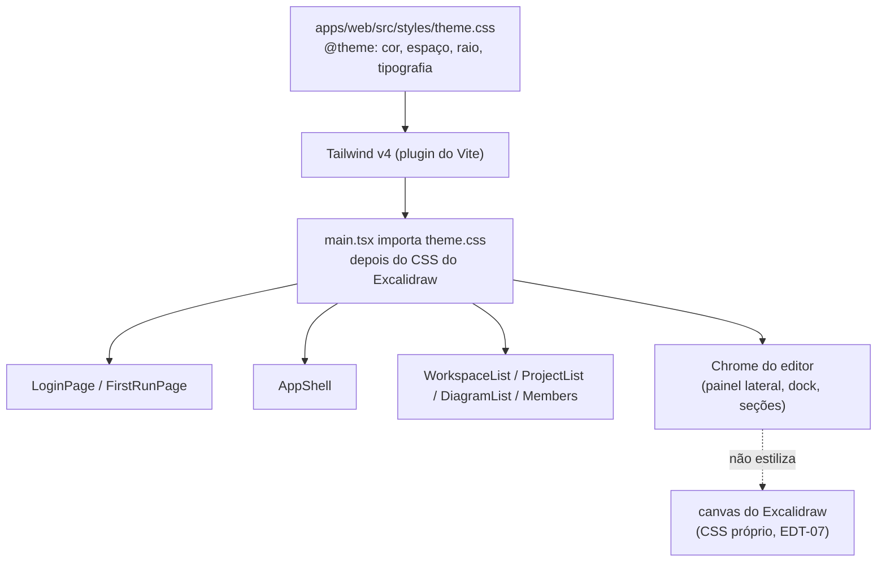

# Fundações de UI Design

**Spec**: `.specs/features/ui-foundations/spec.md`
**Status**: Draft

---

## Architecture Overview

A aplicação não tem camada de estilo — não é um sistema ruim, é a ausência de sistema. O desenho
tem duas metades: **instalar a camada** (uma vez, com tokens) e **aplicá-la tela a tela** (uma tela
por task, cada uma verificável isolada).

Tailwind v4 entra como plugin do Vite com configuração CSS-first: um único `theme.css` declara os
tokens em `@theme` e é o único lugar onde um valor literal de cor, espaçamento ou raio existe. Os
componentes consomem apenas utilitários. Nenhum `style={{}}` sobrevive em componente de produção —
os 9 atuais, todos em `DiagramEditorPage`, são exatamente onde o painel lateral passou a sobrepor o
canvas.

Ordem de importação importa: o CSS do Excalidraw entra primeiro, o da aplicação depois, e nenhuma
regra da aplicação alcança o interior do canvas. Isso preserva AD-008/EDT-07 na camada visual.

---

## Code Reuse Analysis

### Existing Components to Leverage

| Component | Location | How to Use |
| --------- | -------- | ---------- |
| `AppShell` | `apps/web/src/app-shell/AppShell.tsx` | Já tem a semântica correta (`header`/`main`); recebe layout, não estrutura nova |
| `resourceListStore` | `apps/web/src/nav/resourceListStore.ts` | Já expõe `status` (loading/error/ready) — os estados de lista saem dele, sem estado novo |
| Testes `jest-axe` existentes | `apps/web/src/**/*.a11y.spec.tsx` | Passam a ser a rede de segurança contra regressão de acessibilidade durante a estilização |
| i18n | `apps/web/src/i18n/locales/**` | 416 chaves paritárias; nenhuma string nova deve ser escrita direto no componente |
| `EditorSidePanel` | `apps/web/src/diagram/EditorSidePanel.tsx` | Já é o contêiner tabulado; ganha largura própria em vez de dividir espaço por acaso |

### Integration Points

| System | Integration Method |
| ------ | ------------------ |
| Build do Vite | Plugin `@tailwindcss/vite` em `apps/web/vite.config.ts` |
| `main.tsx` | Importa `theme.css` após `@excalidraw/excalidraw/index.css` |
| Rota do editor | `React.lazy` + `Suspense` para o chunk separado (UIF-18..20) |
| Biome | Sem regra nova; classes não são ordenadas por ferramenta (decisão registrada na spec) |

---

## Components

### `theme.css`

- **Purpose**: única declaração de tokens visuais do produto.
- **Location**: `apps/web/src/styles/theme.css`
- **Interfaces**: bloco `@theme` com escalas de cor (superfície, texto, borda, acento, perigo),
  espaçamento, raio, tipografia e sombra.
- **Dependencies**: Tailwind v4
- **Reuses**: nada — é a raiz do sistema

### Primitivas de layout de lista

- **Purpose**: dar a workspaces, projetos, diagramas e membros a mesma forma de linha, ação e estado vazio.
- **Location**: `apps/web/src/app-shell/` (colocalizadas com o shell, não em pacote novo)
- **Interfaces**: composição por utilitários; nenhuma API de componente nova exportada fora de `apps/web`
- **Dependencies**: `theme.css`
- **Reuses**: `resourceListStore`'s `status`

### Chrome do editor

- **Purpose**: dar largura própria ao painel lateral e altura total ao canvas.
- **Location**: `apps/web/src/diagram/DiagramEditorPage.tsx`, `EditorSidePanel.tsx`
- **Interfaces**: nenhuma nova; substitui os 9 `style={{}}` existentes
- **Dependencies**: `theme.css`
- **Reuses**: a estrutura de duas colunas que já existe, agora com largura declarada

---

## Decisões e trade-offs

| Decisão | Alternativa descartada | Por quê |
| ------- | ---------------------- | ------- |
| Tailwind v4 CSS-first | CSS Modules + tokens à mão | Exigiria escrever o sistema (escalas, estados, densidade) antes de estilizar a primeira tela; 41 componentes esperando |
| Tokens só em `@theme` | Valores literais por componente | Um hex escrito num componente é o primeiro passo da divergência que não tem gate |
| Uma tela por task | Uma task "estilizar a UI" | Não seria verificável nem revisável; e é exatamente o tipo de task que a granularidade do gate reprova |
| Sem snapshot visual | Teste de imagem por tela | Exige infraestrutura de imagem e produz falha por antialiasing; as ACs de layout são estruturais |
| Sem tema escuro nesta onda | Tokens claros e escuros de uma vez | Dobra a superfície de token antes de a paleta clara estar estável |

---

## Riscos

| Risco | Mitigação |
| ----- | --------- |
| Regressão de acessibilidade ao estilizar | Os `*.a11y.spec.tsx` existentes rodam a cada task; nenhum é alterado durante esta feature |
| CSS da aplicação vazar para dentro do canvas | Nenhuma regra da aplicação seleciona dentro de `.excalidraw`; verificado por AC (UIF edge case) |
| `React.lazy` na rota do editor quebrar o e2e | O e2e já espera por `.excalidraw`; o estado de carregamento entra antes e o seletor não muda |
| Crescimento do CSS gerado | Tailwind v4 emite só o utilizado; o build reporta o tamanho e a AC de bundle cobre o chunk de entrada |
