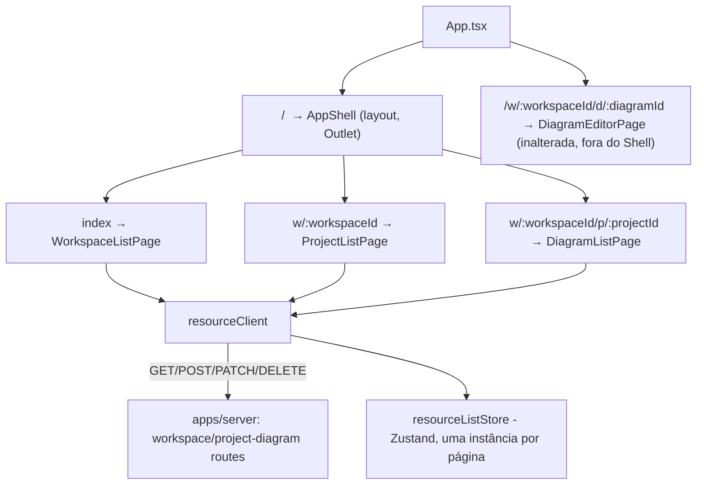

# Navegação de workspace, projetos e diagramas — Design

**Spec**: `.specs/features/workspace-navigation/spec.md`
**Status**: Approved

---

## Approach exploration

Duas decisões arquiteturais reais nesta feature — as únicas onde mais de uma abordagem plausível
existia.

### 1. Rotas aninhadas: `<Route>` filhas vs. migrar para `createBrowserRouter`

`react-router-dom` está em `^7.18.2`, que suporta as duas formas. `sso-sign-in/design.md` já
registrou a razão de manter `<BrowserRouter>`/`<Routes>`/`<Route>` puros em vez de adotar
`createBrowserRouter`/loaders: "introduzir o padrão de data-loaders só para esta fatia seria uma
mudança de arquitetura maior do que a spec pede." Essa razão vale igual aqui — `<Outlet/>` funciona
idêntico dentro de `<Route>` aninhado tradicional, sem precisar de `createBrowserRouter`. **Escolha:
`<Route>` filhas com `<Outlet/>` em `AppShell`.** Não migrar o roteador.

### 2. Papel efetivo do usuário por workspace: novo campo no servidor vs. derivar de `GET /workspaces/:id/members`

`GET /workspaces` hoje devolve `{id, organizationId, name, slug, accessPolicy, createdAt,
updatedAt}` por item — **sem `role`** (confirmado lendo `listWorkspacesForUser`, que faz
`innerJoin(workspaceMembers)` só pro `WHERE`, nunca projeta a coluna). Duas opções:

| | **A — Campo `role` aditivo em `GET /workspaces`/`GET /workspaces/:id` (recomendada)** | **B — Frontend chama `GET /workspaces/:id/members` e filtra pelo próprio `userId`** |
| --- | --- | --- |
| Custo de servidor | Uma linha a mais no `select` de duas funções já existentes | Zero |
| Custo de cliente | Zero chamada extra — o dado já vem na lista/detail que a tela busca de qualquer jeito | Uma chamada por workspace visitado, que devolve a lista **inteira** de membros (superfície de dado maior que o necessário só pra descobrir 1 papel) |
| Precedente | Mesmo padrão de `mutatePermissions` (ai-dock) e `mutatePermissions`-equivalente já usado duas vezes nesta frente | Nenhum — usaria uma rota pensada pra gestão de membros (R4) como um workaround de leitura |
| Superfície de permissão exposta | Só o papel do próprio usuário | Papel e identidade de **todos** os membros do workspace, mesmo que a tela não precise disso |

**Escolhida: A.** Menor superfície de dado exposta, menor número de chamadas, e seguindo
exatamente o precedente que `ai-dock` e `sso-sign-in` já estabeleceram para esse tipo de lacuna
(sinal de permissão ausente → campo aditivo, nunca uma tentativa-e-erro na UI).

---

## Architecture Overview

`AppShell` deixa de ser folha e vira layout: um `<header>` fixo (já existe) mais um `<Outlet/>` que
renderiza a página do nível corrente (lista de workspaces, de projetos, ou de diagramas). As três
páginas de lista compartilham um único par cliente+store genérico (`resourceClient.ts`,
`resourceListStore.ts`), parametrizado por tipo de recurso — não três cópias quase idênticas.



Papel efetivo do usuário: `GET /workspaces` e `GET /workspaces/:id` passam a devolver `role`
(`WorkspaceRole`, de `@arch-canvas/auth`) junto com o item. `ProjectListPage`/`DiagramListPage`
recebem esse `role` via `useOutletContext()` (do `<Outlet/>` de `AppShell`, que por sua vez recebe
de `WorkspaceListPage`'s fetch do item — a confirmar caminho exato nos Componentes) e usam
`can({role}, 'project:write'|'diagram:write', {workspaceId})` (reuso direto de
`@arch-canvas/auth`, puro, sem dependência de DB/HTTP) para decidir mostrar ou esconder
criar/renomear/arquivar — **sinal client-side é só UX, o servidor continua sendo a autoridade**
(um 403 tardio nunca é tratado como bug, é o caminho defensivo).

---

## Code Reuse Analysis

### Existing Components to Leverage

| Component | Location | How to Use |
| --------- | -------- | ---------- |
| `Role`, `can()` | `@arch-canvas/auth` (`packages/auth/src/rbac.ts`) | Pacote puro, zero dependência de runtime — importável direto em `apps/web` (novo, mas trivial: adicionar `@arch-canvas/auth: workspace:*` ao `package.json` do web). Evita redeclarar o union de papéis e a lógica de grant à mão. |
| `createSaveStatusStore`/`createAiDockStore` (padrão) | `apps/web/src/sync/saveStatus.ts`, `apps/web/src/ai-dock/aiDockStore.ts` | Molde para `resourceListStore.ts` — factory Zustand, `useMemo` no componente. |
| `DiagramSyncClient`/`AiDockClient`/`AuthProvider` (padrão) | `apps/web/src/sync/`, `apps/web/src/ai-dock/`, `apps/web/src/auth/` | Molde para `resourceClient.ts`: `fetchImpl` injetável, branch por `response.status`. |
| `.map(...).key=...`, `<ul>/<li>` | `apps/web/src/ai-dock/AiDock.tsx:154-167` | Único precedente de renderização de lista no app — mesmo padrão, estendido com ações por item (novo, nenhum precedente CRUD existe). |
| `<details>/<summary>` nativo em vez de widget customizado | `apps/web/src/ai-dock/AiDock.tsx` (painel recolhível) | Mesma convenção de preferir elemento HTML nativo — usada aqui para o `<dialog>` de confirmação (ver Componentes). |
| `ProtectedRoute` | `apps/web/src/auth/ProtectedRoute.tsx` | Reusado tal qual — as três páginas de lista continuam atrás dele, sem mudança na própria guarda. |

### Integration Points

| System | Integration Method |
| ------ | ------------------- |
| `GET /workspaces`, `GET /workspaces/:id` | Mudança de contrato aditiva: novo campo `role`. |
| `GET/POST/PATCH/DELETE` de projetos e diagramas | Consumidas tal como estão — nenhuma mudança. |
| `@arch-canvas/auth` | Primeira vez que `apps/web` depende deste pacote — dependência nova no `package.json`, sem mudança no pacote em si. |

---

## Components

### `role` em `GET /workspaces`/`GET /workspaces/:id` (servidor)

- **Purpose**: dar ao frontend o papel efetivo do usuário em cada workspace, sem chamada extra.
- **Location**: `apps/server/src/modules/workspace/workspaces.ts` (`listWorkspacesForUser`,
  `getWorkspaceById`), `routes.ts` (handlers).
- **Interface**: cada item de `{items: [...]}` e o `{workspace}` de detalhe ganham `role:
  WorkspaceRole` — projetado a partir de `workspaceMembers.role` (já disponível no `innerJoin` de
  `listWorkspacesForUser`; `getWorkspaceById` precisa de um `innerJoin` novo, hoje é `select()`
  simples só em `workspaces`).
- **Reuses**: o enum `workspaceMemberRole`/`ROLE_VALUES` já definido.

### `resourceClient.ts` (genérico, parametrizado)

- **Purpose**: um cliente HTTP só, usado três vezes (workspace/projeto/diagrama) em vez de três
  quase-cópias — list/create/rename/archive são a mesma forma nos três recursos, só a URL e o nome
  do campo (`name` vs `title`) mudam.
- **Location**: `apps/web/src/nav/resourceClient.ts`.
- **Interfaces**:
  ```ts
  interface ResourceClientConfig<T> {
    listUrl: string;                          // ex: '/workspaces', `/projects?workspaceId=${id}`
    createUrl: string;
    createBody: (name: string) => object;     // {name, slug} | {workspaceId, name} | {projectId, title}
    itemUrl: (id: string) => string;          // '/workspaces/:id' etc, pra PATCH/DELETE
    renameBody: (name: string) => object;     // {name} | {title}
  }
  export function createResourceClient<T>(config: ResourceClientConfig<T>, fetchImpl?: typeof fetch): {
    list(): Promise<T[]>;
    create(name: string): Promise<{ status: 'created'; item: T } | { status: 'conflict' } | { status: 'error' }>;
    rename(id: string, name: string): Promise<{ status: 'ok'; item: T } | { status: 'conflict' } | { status: 'error' }>;
    archive(id: string): Promise<{ status: 'ok' } | { status: 'error' }>;
  };
  ```
- **Dependencies**: `fetch` (injetável, mesmo padrão `fetchImpl ?? fetch.bind(globalThis)`).
- **Reuses**: molde estrutural de `AiDockClient`/`DiagramSyncClient`.

### `resourceListStore.ts` (genérico, parametrizado)

- **Purpose**: estado de uma lista — itens, carregando, erro, papel efetivo (quando aplicável).
- **Location**: `apps/web/src/nav/resourceListStore.ts`.
- **Interfaces**:
  ```ts
  export interface ResourceListState<T> {
    items: T[];
    status: 'loading' | 'ready' | 'error';
    setItems: (items: T[]) => void;
    setError: () => void;
    addItem: (item: T) => void;
    removeItem: (id: string) => void;
    replaceItem: (id: string, item: T) => void;
  }
  export function createResourceListStore<T extends { id: string }>(): UseBoundStore<StoreApi<ResourceListState<T>>>;
  ```
- **Reuses**: molde de `createSaveStatusStore`.

### `WorkspaceListPage`, `ProjectListPage`, `DiagramListPage`

- **Purpose**: as três telas de lista — cada uma monta seu próprio `resourceClient`/`resourceListStore` com a config certa, renderiza a lista, o formulário de criar (inline), o campo de renomear (inline, por item), e aciona `ConfirmArchiveDialog`.
- **Location**: `apps/web/src/nav/WorkspaceListPage.tsx`, `ProjectListPage.tsx`, `DiagramListPage.tsx`.
- **Interfaces**: sem props — `WorkspaceListPage` é a rota `index`; `ProjectListPage`/`DiagramListPage` leem `:workspaceId`/`:projectId` via `useParams()`.
- **Dependencies**: `resourceClient`, `resourceListStore`, `useTranslation()`, `can()` de `@arch-canvas/auth` (só em `ProjectListPage`/`DiagramListPage` — `WorkspaceListPage` não esconde "criar workspace" de ninguém, por spec).
- **Reuses**: tudo acima.
- **Estado vazio de `WorkspaceListPage`**: quando `items.length === 0` e `status === 'ready'`, renderiza o CTA dedicado de NAV-22 em vez da lista/formulário padrão.

### `ConfirmArchiveDialog`

- **Purpose**: primeira confirmação modal do app — `<dialog>` HTML nativo (`showModal()`/`close()`), não `window.confirm` nem um div customizado.
- **Location**: `apps/web/src/nav/ConfirmArchiveDialog.tsx`.
- **Interfaces**: `{ itemName: string; onConfirm: () => void; onCancel: () => void }`, controlado via `ref` + `showModal()`/`close()` (padrão React 19 para `<dialog>`).
- **Reuses**: `<dialog>` nativo dá foco preso e fechamento por Esc de graça — mesma filosofia "nativo antes de widget customizado" já em uso no projeto.

### `AppShell` (extensão)

- **Purpose**: vira layout — `<main>` ganha `<Outlet/>` no lugar do `<main />` vazio.
- **Location**: `apps/web/src/app-shell/AppShell.tsx`.
- **Mudança**: `<main />` → `<main><Outlet/></main>`. Nada mais no componente muda.

### `App.tsx` (extensão)

- **Mudança**: a rota `/` vira pai com filhas (`index` → `WorkspaceListPage`, `w/:workspaceId` → `ProjectListPage`, `w/:workspaceId/p/:projectId` → `DiagramListPage`), todas dentro do mesmo `<ProtectedRoute><AppShell/></ProtectedRoute>` já existente. A rota do editor (`/w/:workspaceId/d/:diagramId`) continua irmã, fora do Shell — não muda.

---

## Data Models

### `WorkspaceRole` (cliente)

```typescript
import type { Role } from '@arch-canvas/auth';
type WorkspaceRole = Role; // 'org_admin' | 'workspace_admin' | 'editor' | 'reviewer' | 'viewer'
```

### Resposta de `GET /workspaces`/`GET /workspaces/:id` (servidor, aditivo)

```typescript
interface WorkspaceListItem {
  id: string; organizationId: string; name: string; slug: string;
  accessPolicy: unknown; createdAt: string; updatedAt: string;
  role: WorkspaceRole; // NOVO
}
```

### `Project`, `Diagram` (cliente, espelham as colunas já devolvidas, sem mudança de servidor)

```typescript
interface Project { id: string; workspaceId: string; name: string; /* ...demais campos ignorados por esta fatia */ }
interface Diagram { id: string; projectId: string; title: string; }
```

---

## Error Handling Strategy

| Error Scenario | Handling | User Impact |
| --------------- | -------- | ------------ |
| `POST /workspaces` → 409 (slug duplicado) | Mensagem de conflito, nome digitado preservado | NAV-08 |
| `PATCH /workspaces/:id` → 409 | Mensagem de conflito, valor anterior mantido visível | NAV-15 |
| Qualquer `PATCH`/`DELETE` → 403/404 | Mensagem de falha, estado anterior preservado (nunca aplicado otimisticamente) | NAV-16, NAV-20 |
| `GET .../:id` (resolver nome do nível corrente) → 404 | "não existe ou sem acesso", nunca distingue os dois casos | NAV-04 (mesma convenção IDOR do servidor) |
| Criar com nome vazio/só espaço | Nenhuma requisição emitida | Edge Case |
| Papel revogado enquanto a tela está aberta | Ação de escrita tentada → 403 tratado como qualquer outro 403; sem revalidação em tempo real dentro da mesma tela (só ao navegar de novo) | Edge Case, disclosed |

---

## Risks & Concerns

| Concern | Location (file:line) | Impact | Mitigation |
| ------- | -------------------- | ------ | ---------- |
| Nenhuma das três rotas de lista pagina — `{items: [...]}` completo sempre | `apps/server/src/modules/workspace/{workspaces,projects,diagrams}.ts` (`select()` sem `limit`/`cursor`) | Um workspace com centenas de projetos ou diagramas carrega tudo de uma vez | Fora do escopo desta fatia (Out of Scope da spec) — se virar problema real, é mudança de contrato de servidor, spec própria |
| `role` vira um campo a mais pra manter sincronizado se o modelo de permissão mudar (ex. papéis por recurso em vez de só por workspace) | novo, introduzido por esta feature | Baixo — é só leitura, computada a partir do mesmo `workspaceMembers.role` que já é a fonte de verdade em todo o resto do backend | Nenhuma necessária, é a mesma fonte, só projetada a mais |
| `resourceClient`/`resourceListStore` genéricos são a primeira abstração compartilhada entre 3 recursos nesta frente — risco de over-fit se um quarto recurso (futuro) não encaixar na forma list/create/rename/archive | novo | Baixo — só workspace/projeto/diagrama existem nesse formato hoje; um quarto caso que não encaixe simplesmente não usa o genérico, sem forçar | Nenhuma — reavaliar só se/quando aparecer um quarto uso real |

> Nenhum outro risco de segurança, performance ou dívida técnica identificado nas áreas tocadas por
> esta feature.

---

## Tech Decisions

| Decision | Choice | Rationale |
| -------- | ------ | --------- |
| Rotas aninhadas | `<Route>` filhas + `<Outlet/>`, sem migrar pra `createBrowserRouter` | Ver Approach exploration — consistente com a decisão já registrada em `sso-sign-in/design.md`. |
| Papel efetivo do usuário por workspace | Campo `role` aditivo em `GET /workspaces`/`GET /workspaces/:id` | Ver Approach exploration — menor superfície exposta, sem chamada extra, mesmo precedente de `mutatePermissions`. |
| Cliente/store de lista | Genérico, parametrizado, uma implementação pros três recursos | Três recursos com a mesma forma (list/create/rename/archive) — reuso real, não abstração especulativa. |
| Confirmação de arquivar | `<dialog>` HTML nativo | Foco preso e fechamento por Esc de graça, sem nova dependência, mesma filosofia "nativo antes de customizado" já em uso. |
| Dependência nova em `apps/web` | `@arch-canvas/auth` (tipo `Role` + função `can()`) | Pacote puro (zero dependência de runtime), evita redeclarar união de papéis e lógica de grant à mão — reuso real de um pacote já pensado pra ser importado de qualquer lugar. |

---

## Tasks preview (não vinculante)

Ordem natural: servidor (`role` aditivo) → `resourceClient`/`resourceListStore` genéricos →
`ConfirmArchiveDialog` → as três páginas (cada uma depende dos genéricos + do dialog) → `AppShell`/`App.tsx` (integração final, depende de todas as três páginas existirem). Dado o tamanho (~15
rotas, 3 superfícies, "1,5 onda" no roadmap), a rodada de Tasks provavelmente produz entre 12 e 16
tasks — dentro do orçamento de 2 lotes de sub-agente.
